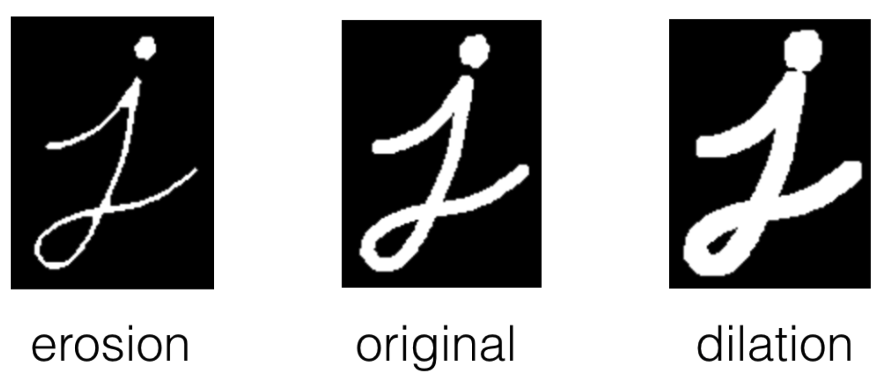
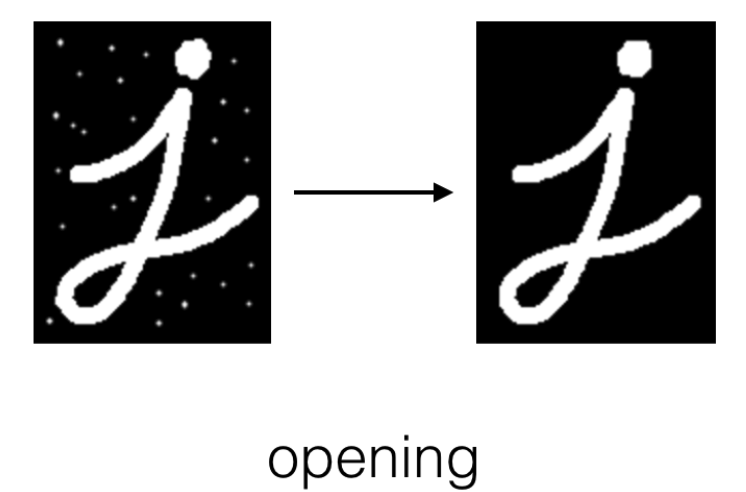
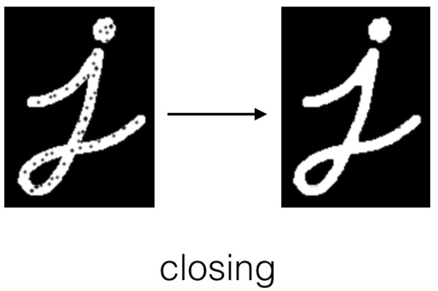
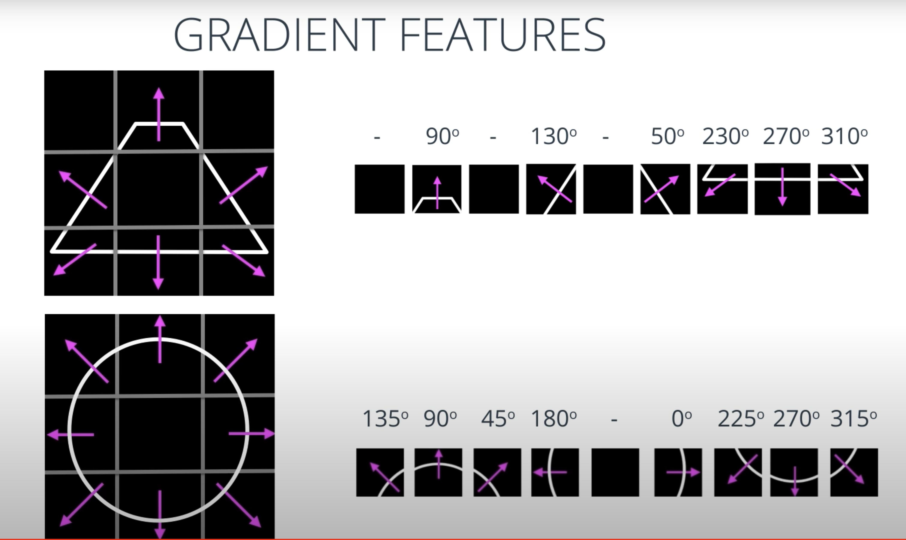
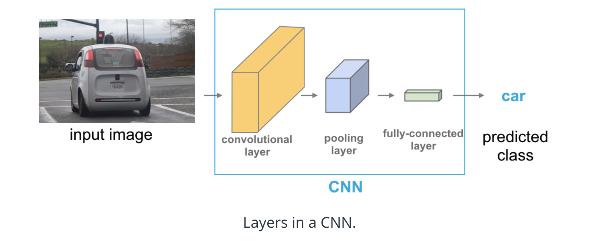

# Image frequency & Filters
High-frequency components also correspond to the edges of objects in images, which can help us classify those objects.

## Fourier Transform

The Fourier Transform (FT) is an important image processing tool which is used to decompose an image into its frequency components. The output of an FT represents the image in the frequency domain, while the input image is the spatial domain (x, y) equivalent. In the frequency domain image, each point represents a particular frequency contained in the spatial domain image. So, for images with a lot of high-frequency components (edges, corners, and stripes), there will be a number of points in the frequency domain at high frequency values.

Take a look at how FT's are done with OpenCV, [here](https://docs.opencv.org/3.0-beta/doc/py_tutorials/py_imgproc/py_transforms/py_fourier_transform/py_fourier_transform.html).
This decomposition is particularly interesting in the context of bandpass filters, which can isolate a certain range of frequencies and mask an image according to a low and high frequency threshold.

## Types of features
1. edges: areas with a a high intensity gradient
2. corners: intersection of two edges
3. blobs: region-based features, areas of extreme brightness or unique texture

croners match exactly and are good features because they are unique to identify the region
 ### Corner Detectors
 https://www.youtube.com/watch?v=jemzDq07MEI
A corner can be located by following these steps:

Calculate the gradient for a small window of the image, using sobel-x and sobel-y operators (without applying binary thesholding).
Use vector addition to calculate the magnitude and direction of the total gradient from these two values.

Apply this calculation as you slide the window across the image, calculating the gradient of each window. When a big variation in the direction & magnitude of the gradient has been detected - a corner has been found!
Further Reading
You can learn more about Harris Corner Detection in OpenCV, [here](https://docs.opencv.org/4.x/dc/d0d/tutorial_py_features_harris.html).

### Dilation and Erosion
Dilation and erosion are known as morphological operations. They are often performed on binary images, similar to contour detection. Dilation enlarges bright, white areas in an image by adding pixels to the perceived boundaries of objects in that image. Erosion does the opposite: it removes pixels along object boundaries and shrinks the size of objects.

Dilation
To dilate an image in OpenCV, you can use the dilate function and three inputs: an original binary image, a kernel that determines the size of the dilation (None will result in a default size), and a number of iterations to perform the dilation (typically = 1). In the below example, we have a 5x5 kernel of ones, which move over an image, like a filter, and turn a pixel white if any of its surrounding pixels are white in a 5x5 window! We’ll use a simple image of the cursive letter “j” as an example.
```
# Reads in a binary image
image = cv2.imread(‘j.png’, 0)

# Create a 5x5 kernel of ones
kernel = np.ones((5,5),np.uint8)

# Dilate the image
dilation = cv2.dilate(image, kernel, iterations = 1)
```

Erosion
To erode an image, we do the same but with the erode function.
```
# Erode the image
erosion = cv2.erode(image, kernel, iterations = 1)
```



Opening
As mentioned, above, these operations are often combined for desired results! One such combination is called opening, which is erosion followed by dilation. This is useful in noise reduction in which erosion first gets rid of noise (and shrinks the object) then dilation enlarges the object again, but the noise will have disappeared from the previous erosion!

To implement this in OpenCV, we use the function morphologyEx with our original image, the operation we want to perform, and our kernel passed in.

  opening = cv2.morphologyEx(image, cv2.MORPH_OPEN, kernel)

Closing
Closing is the reverse combination of opening; it’s dilation followed by erosion, which is useful in closing small holes or dark areas within an object.

Closing is reverse of Opening, Dilation followed by Erosion. It is useful in closing small holes inside the foreground objects, or small black points on the object.

  closing = cv2.morphologyEx(img, cv2.MORPH_CLOSE, kernel)




## Image Segmentation
Grouping or segmenting images into distinct parts is known as image segmentation.
- using contours to draw boundaries around different parts of an image, and
- clustering image data by some measure of color or texture similarity.

### image countour
https://www.youtube.com/watch?v=Wcbrl7Wr_kU

### K-means Clustering
https://www.youtube.com/watch?v=Cf_LSDCEBzk
https://www.youtube.com/watch?v=poKlg-aB4rU

convergence can be how much distance the center moved after new iteration
# Feature Vectors
A single corner will not be enough to identify this mountain in any other images, but, we can take a set of features that define the shape of this mountain, group them together into an array or vector, and then use that set of features to create a mountain detector!

https://www.youtube.com/watch?v=-PF1_MITrOw




# Motivation of convolution
1. sparse interaction: traditional NN use matrix multiplication by a matrix of parameteres with a separate parameter describing the interaction between each input unit and each output unit. This means every output unit interacts with every input unit. Con Networks, however typically have sparse interactions (sparse connectivity or sparse weights) by making the kernel smaller than the input. with kernels, we can detect small, meaningful features such as edges. This means we neeed to store fewer parmeteres, which both reduces the memory requirements and improve model statistical efficiency. In a  deep conv net, units in deeper layers may indirectly interact with a larger portion of the inputs.
2. parameter sharing: using the same parameter for more than one function in a model. In a traditinal NN, each element of the weight matrix is used exactly once when computing the output of a layer. In convnet, each member of the kernel is used at every position of the input. This means rather than learning a separate set of parameters for every location, we learn only one set.
# CNN
https://stanford.edu/~shervine/teaching/cs-230/cheatsheet-convolutional-neural-networks

Convolutional neural networks (CNNs) consist of alternating convolutional layers and pooling layers. Convolution layers take inner product of the linear filter and the underlying receptive field followed by a nonlinear activation function at every local portion of the input. The resulting outputs
are called feature maps.

[video for convolutional layer](https://www.youtube.com/watch?v=LX-yVob3c28)


- [An Intuitive Explanation of Convolutional Neural Networks](https://ujjwalkarn.me/2016/08/11/intuitive-explanation-convnets/):
    The primary purpose of Convolution in case of a ConvNet is to extract features from the input image. Convolution preserves the spatial relationship between pixels by learning image features using small squares of input data.
    

    the Convolution + Pooling layers act as Feature Extractors from the input image while Fully Connected layer acts as a classifier.
- [Stanford CNN](https://cs231n.github.io/convolutional-networks/)
- [Convolutional Neural Networks Math](https://andrew.gibiansky.com/blog/machine-learning/convolutional-neural-networks/)
- [A Quick Introduction to Neural Networks](https://ujjwalkarn.me/2016/08/09/quick-intro-neural-networks/)


For data over 200mil images , Vision transformer is much better
For less than 100 mil images , Resnet
## Pooling
a pooling function replaces the output of the net at a certain location with a summary statistitic of the nearby outputs. Max pooling, average, L2 norm, or a weighted average based on the distance from the central pixel.
In all cases, pooling helps to make the representation approximately invarant to small translations of the input. meaning that if we translate the input by a small amount, the values of most of the pooled outputs do not change.Invaraince to local trasnlation can be a sueful property if we care more about whether some features is present than exactly where it is. In other contexts, it is more important to preserve the location of a feature, e.g. if we want to find a corner defiend by two edges meeting ata a specific orentation, we need to preserve the location of the edges well enought to test whether they meet.

For many tasks, pooling is essential for handling inputs of varying size. e.g if we want to classify images of variable size, the input to the classification layer must have a fixed size. This is usually accomplished by varying the size of an offset between pooling regions so that the classification layer always receives the same number of summary statistics regardless of the input size.

# Vision Transformer
Thanks
to Transformers’ computational efficiency and scalability, it has become possible to train models of
unprecedented size, with over 100B parameters

- [An Image is Worth 16x16 Words: Transformers for Image Recognition at Scale](https://arxiv.org/abs/2010.11929): When pre-trained on large amounts of
data and transferred to multiple mid-sized or small image recognition benchmarks
(ImageNet, CIFAR-100, VTAB, etc.), Vision Transformer (ViT) attains excellent
results compared to state-of-the-art convolutional networks while requiring substantially
fewer computational resources to train.


- [Attention is all you need.](https://arxiv.org/pdf/1706.03762.pdf): Self-attention-based architectures, in particular Transformers, have become the model of choice in natural language processing (NLP). This inherently
sequential nature precludes parallelization within training examples, which becomes critical at longer
sequence lengths, as memory constraints limit batching across examples.  In this work we propose the Transformer, a model architecture eschewing recurrence and instead
relying entirely on an attention mechanism to draw global dependencies between input and output.

- [BERT: Pre-training of deep
bidirectional transformers for language understanding](https://arxiv.org/abs/1810.04805): The dominant approach is to pre-train on
a large text corpus and then fine-tune on a smaller task-specific dataset


# Sequential modeling
## Run time complexity for Modeling
1.  The goal of reducing sequential computation also forms the foundation of the Extended Neural GPU
[16], ByteNet [18] and ConvS2S [9], all of which use convolutional neural networks as basic building
block, computing hidden representations in parallel for all input and output positions. In these models,
the number of operations required to relate signals from two arbitrary input or output positions grows
in the distance between positions, linearly for ConvS2S and logarithmically for ByteNet. This makes
it more difficult to learn dependencies between distant positions [12]. In the Transformer this is
reduced to a constant number of operations, albeit at the cost of reduced effective resolution due
to averaging attention-weighted positions, an effect we counteract with Multi-Head Attention    - "Attention is All you need"

## Self-Attention
Self-attention, sometimes called intra-attention is an attention mechanism relating different positions
of a single sequence in order to compute a representation of the sequence. Self-attention has been
used successfully in a variety of tasks including reading comprehension, abstractive summarization,
textual entailment and learning task-independent sentence representations

- 2016 [Long Short-Term Memory-Networks for Machine Reading](https://arxiv.org/abs/1601.06733)
- 2016 [A Decomposable Attention Model for Natural Language Inference
](https://arxiv.org/abs/1606.01933)
- 2017 [A Structured Self-attentive Sentence Embedding](https://arxiv.org/abs/1703.03130)
- 2017 [A Deep Reinforced Model for Abstractive Summarization
](https://arxiv.org/abs/1705.04304)

## Transformer
the Transformer is the first transduction model relying
entirely on self-attention to compute representations of its input and output without using sequencealigned
RNNs or convolution -  "Attention is All you need"
## Encoder-Decoder
Sequence to Sequence (often abbreviated to seq2seq) models are a special class of Recurrent Neural Network architectures typically used (but not restricted) to solve complex Language related problems like Machine Translation, Question Answering, creating Chat-bots, Text Summarization, etc.

- A
basic form of NMT consists of two components:
(a) an encoder which computes a representation s
for each source sentence and (b) a decoder which
generates one target word at a time and hence decomposes
the conditional probability as

- [Word Level English to Marathi Neural Machine Translation using Encoder-Decoder Model](https://towardsdatascience.com/word-level-english-to-marathi-neural-machine-translation-using-seq2seq-encoder-decoder-lstm-model-1a913f2dc4a7)
- [Understanding LSTM Networks](http://colah.github.io/posts/2015-08-Understanding-LSTMs/)
- [The Unreasonable Effectiveness of Recurrent Neural Networks](http://karpathy.github.io/2015/05/21/rnn-effectiveness/)
- [Found in translation: Building a language translator from scratch with deep learning](https://blog.floydhub.com/language-translator/)
## Attention
- Used in [Neural machine translation by jointly
learning to align and translate](https://arxiv.org/pdf/1409.0473.pdf) : the alignment model directly computes a soft alignment, which allows the gradient of the cost function to be backpropagated through.
This gradient can be used to train the alignment model as well as the whole translation model jointly.
We can understand the approach of taking a weighted sum of all the annotations as computing an
expected annotation, where the expectation is over possible alignments. Let αij be a probability that
the target word yi
is aligned to, or translated from, a source word xj . Then, the i-th context vector
ci is the expected annotation over all the annotations with probabilities αij .
The probability αij , or its associated energy eij , reflects the importance of the annotation hj with
respect to the previous hidden state si−1 in deciding the next state si and generating yi. Intuitively,
this implements a mechanism of attention in the decoder. The decoder decides parts of the source
sentence to pay attention to. By letting the decoder have an attention mechanism, we relieve the
encoder from the burden of having to encode all information in the source sentence into a fixedlength vector. With this new approach the information can be spread throughout the sequence of
annotations, which can be selectively retrieved by the decoder accordingly

- [Attention Mechanism](https://blog.floydhub.com/attention-mechanism/): While Attention does have its application in other fields of deep learning such as Computer Vision, its main breakthrough and success comes from its application in Natural Language Processing (NLP) tasks. This is due to the fact that Attention was introduced to address the problem of long sequences in Machine Translation, which is also a problem for most other NLP tasks as well.

  - The standard seq2seq model is generally unable to accurately process long input sequences, since only the last hidden state of the encoder RNN is used as the context vector for the decoder. On the other hand, the Attention Mechanism directly addresses this issue as it retains and utilises all the hidden states of the input sequence during the decoding process. It does this by creating a unique mapping between each time step of the decoder output to all the encoder hidden states. This means that for each output that the decoder makes, it has access to the entire input sequence and can selectively pick out specific elements from that sequence to produce the output.

-[Effective Approaches to Attention-based Neural Machine Translation](https://arxiv.org/pdf/1508.04025.pdf)

## Embedding
Much progress has been made in learning semantically meaningful distributed representations of
individual words, also known as word embeddings (Bengio et al., 2001; Mikolov et al., 2013)
On the other hand, much remains to be done to obtain satisfying representations of phrases and
sentences. Those methods generally fall into two categories. The first consists of universal sentence
embeddings usually trained by unsupervised learning (Hill et al., 2016). The other category consists of models trained specifically for a certain task.
They are usually
combined with downstream applications and trained by supervised learning. One generally finds
that specifically trained sentence embeddings perform better than generic ones, although generic
ones can be used in a semi-supervised setting, exploiting large unlabeled corpora

### Approach
- A common approach in previous
methods consists in creating a simple vector representation by using the final hidden state of the
RNN or the max (or average) pooling from either RNNs hidden states or convolved n-grams. We hypothesize that carrying the semantics along
all time steps of a recurrent model is relatively hard and not necessary. We propose a self-attention
mechanism for these sequential models to replace the max pooling or averaging step.
- Additional works have also been done in exploiting linguistic structures such as parse and dependence
trees to improve sentence representations (Ma et al., 2015; Mou et al., 2015b; Tai et al., 2015).

## Applications
- [A Must-Read Introduction to Sequence Modelling (with use cases)](https://www.analyticsvidhya.com/blog/2018/04/sequence-modelling-an-introduction-with-practical-use-cases/)
