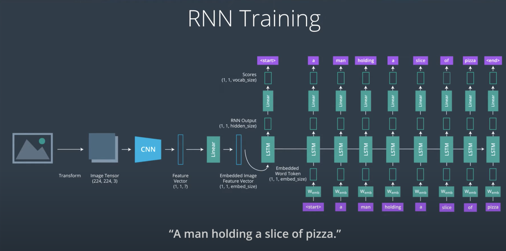

# Part1
## Feature Vectors (Feature extraction techniques)
Convolutional filters and ORB and HOG descriptors all rely on patterns of intensity to identify different shapes (like edges) and eventually whole objects (with feature vectors).

## ORB
- oriented fast and
- roated
- brief

## Keypoint
keypoint: small region in an image that is particularly distinctive. e.g corners where the pixel values sharply change from light to dark

ORB generated keypoints


once keypoints in an image have been located, ORB calculate correponding feature vector for each keypoint, only containing binary values.
The sequence of ones and zeros vary accordig to what a specific keypoint and its surrounding pixel area look like. The vector represnets the pattern of intensity around a key point.
So multiple feature vectors can be used to identiy a large area, and even a specific object in an image.
### FAST (Features from accelerated segments Test)
find keypoint in an image: [youtube](https://www.youtube.com/watch?v=DCHAc6fjcVM)
### BRIEF (Binary robost independent elementary features)
creat feature vectors from keypoint: [youtube](https://www.youtube.com/watch?v=EKIPEPpRciw)
- to handle object of diffrent scale and object orientation: [youtube](https://www.youtube.com/watch?v=2k3T6rfjvx0)
### Feature Matching
https://www.youtube.com/watch?v=RH05Wnl1-2A
- [limitation](https://www.youtube.com/watch?v=Vzs6B1dFQC0)

## HOG (Histograms of Oriented Gradients )
[youtube](https://www.youtube.com/watch?v=dqe9zGtxoNM)

# CNN
## CNN Layers
[youtube](https://www.youtube.com/watch?v=LX-yVob3c28)
## Pooling and global average pooling layers
for recuding number of parameters used, and reducing dimension of each plane. Too many parameters can cause overfitting
[youtube](https://www.youtube.com/watch?v=OkkIZNs7Cyc)

## Dropout Layers
https://pytorch.org/docs/stable/nn.html#dropout-layers
Dropout layers essentially turn off certain nodes in a layer with some probability, p. This ensures that all nodes get an equal chance to try and classify different images during training, and it reduces the likelihood that only a few, heavily-weighted nodes will dominate the process.

to get out of local minimum (overfitting): dropout, momentum
## Dropout
Dropout randomly turns off perceptrons (nodes) that make up the layers of our network, with some specified probability. It may seem counterintuitive to throw away a connection in our network, but as a network trains, some nodes can dominate others or end up making large mistakes, and dropout gives us a way to balance our network so that every node works equally towards the same goal, and if one makes a mistake, it won't dominate the behavior of our model. You can think of dropout as a technique that makes a network resilient; it makes all the nodes work well as a team by making sure no node is too weak or too strong. In fact it makes me think of the Chaos Monkey tool that is used to test for system/website failures.

Look at the [PyTorch dropout documentation](https://pytorch.org/docs/stable/nn.html#dropout-layers)
## Momentum
When you train a network, you specify an optimizer that aims to reduce the errors that your network makes during training. The errors that it makes should generally reduce over time but there may be some bumps along the way. Gradient descent optimization relies on finding a local minimum for an error, but it has trouble finding the global minimum which is the lowest an error can get. So, we add a momentum term to help us find and then move on from local minimums and find the global minimum!
- [video](https://www.youtube.com/watch?v=r-rYz_PEWC8)

[A Walk-through of AlexNet](https://medium.com/@smallfishbigsea/a-walk-through-of-alexnet-6cbd137a5637)
# Part2
## classification & localization
how to localize (draw boudnign box)? How to detect multiple objects in a single image?
What if you don't know how many objects in an image but CNN has defined number of outputs? And also many of the objects have varying size and location. the easist solution is to break the image up into smaller regions, e.g sliding windows. The problem is it produce huge amount of images and many of them don't even have an object.

### Region Proposals
Look at an image and quickly generate regions for areas in which there may be an object. We can use traditional CV techniques that detect things like edges and textured blobs to produce a set of regions. They often product noisy non-object regions, but alos likely to include regions in which objects are located. So the noise is considered a worthwhile cost for not missing any objects.
But it is still expensive cuz it requires each cropped region go through the entire CNN to produce class labels.
#### R-CNN
The R-CNN is the least sophisticated region-based architecture, but it is the basis for understanding how multiple object recognition algorithms work! It outputs a class score and bounding box coordinates for every input RoI.
An R-CNN feeds an image into a CNN with regions of interest (RoI’s) already identified. Since these RoI’s are of varying sizes, they often need to be warped to be a standard size, since CNN’s typically expect a consistent, square image size as input. After RoI's are warped, the R-CNN architecture, processes these regions one by one and, for each image, produces 1. a class label and 2. a bounding box (that may act as a slight correction to the input region).

- R-CNN produces bounding box coordinates to reduce localization errors; so a region comes in, but it may not perfectly surround a given object and the output coordinates (x,y,w,h) aim to perfectly localize an object in a given region.
- R-CNN, unlike other models, does not explicitly produce a confidence score that indicates whether an object is in a region, instead it cleverly produces a set of class scores for which one class is "background". This ends up serving a similar purpose, for example, if the class score for a region is Pbackground = 0.10, it likely contains an object, but if it's Pbackground = 0.90, then the region probably doesn't contain an object.
#### Fast R-CNN
RoI Pooling, first proposed by Ross Girshick [Fast R-CNN paper](https://deepsense.ai/wp-content/uploads/2017/02/1504.08083.pdf)
To warp regions of interest into a consistent size for further analysis, some networks use RoI pooling. RoI pooling is an additional layer in our network that takes in a rectangular region of any size, performs a maxpooling operation on that region in pieces such that the output is a fixed shape.
```
[[0.85, 0.34, 0.76],
 [0.32, 0.74, 0.21]]
 ```
 Will become a single max value after pooling: 0.85. After applying this to an image in these pieces, you can see how any rectangular region can be forced into a smaller, square representation.
 An example of pooling sections, credit to [region-of-interest-pooling-explained by Tomasz Grel](https://deepsense.ai/region-of-interest-pooling-explained/)


https://www.youtube.com/watch?v=6FOBZ9OgWlY

[ROI-Pooling Implementation](https://github.com/deepsense-ai/roi-pooling)
Speed: Fast R-CNN is about 10 times as fast to train as an R-CNN because it only creates convolutional layers once for a given image and then performs further analysis on the layer. Fast R-CNN also takes a shorter time to test on a new image! It’s test time is dominated by the time it takes to create region proposals.
#### Faster R-CNN
https://www.youtube.com/watch?v=ySh_Q3KTTBY
It add a seprate region proposal network so it predicts itws own regions from the feature produced inside the network. It does a binary check, for each ROI it checks whether or not that region contains an object. If it does then the region will continue on and go throguh the classification steps, otherwise the proposal is disgarded.
it Illiminates the analysis of non-object regions.
- Region Proposal Network:
You may be wondering: how exactly are the RoI's generated in the region proposal portion of the Faster R-CNN architecture?

The region proposal network (RPN) works in Faster R-CNN in a way that is similar to YOLO object detection, which you'll learn about in the next lesson. The RPN looks at the output of the last convolutional layer, a produced feature map, and takes a sliding window approach to possible-object detection. It slides a small (typically 3x3) window over the feature map, then for each window the RPN:

Uses a set of defined anchor boxes, which are boxes of a defined aspect ratio (wide and short or tall and thin, for example) to generate multiple possible RoI's, each of these is considered a region proposal.
For each proposal, this network produces a probability, Pc, that classifies the region as an object (or not) and a set of bounding box coordinates for that object.
Regions with too low a probability of being an object, say Pc < 0.5, are discarded.
- Training the Region Proposal Network
Since, in this case, there are no ground truth regions, how do you train the region proposal network?

The idea is, for any region, you can check to see if it overlaps with any of the ground truth objects. That is, for a region, if we classify that region as an object or not-object, which class will it fall into? For a region proposal that does cover some portion of an object, we should say that there is a high probability that this region has an object init and that region should be kept; if the likelihood of an object being in a region is too low, that region should be discarded.

Read [Deep Learning for Object Detection: A Comprehensive Review](https://towardsdatascience.com/deep-learning-for-object-detection-a-comprehensive-review-73930816d8d9) if you'd like to learn more about region selection.

- Speed Bottleneck
Now, for all of these networks including Faster R-CNN, we've aimed to improve the speed of our object detection models by reducing the time it takes to generate and decide on region proposals. You might be wondering: is there a way to get rid of this proposal step entirely? And in the next section we'll see a method that does not rely on region proposals to work!

## Hyperparameters
###  Learning Rate
https://www.youtube.com/watch?v=HLMjeDez7ps

"The single most important hyperparameter and one should always make sure that has been tuned - Yoshua Bengio"
. Good starting point can be 0.01, usual candidates 0.1, 0.01, 0.001, 0.0001, 0.00001, 0.000001
    - Exponential Decay in TensorFlow.
    - Adaptive Learning Optimizers
        - AdamOptimizer
        - AdagradOptimizer


###  MiniBatch Size
1,2,4,8, 16, 32, 64, 128, 256...2048

https://www.youtube.com/watch?v=GrrO1NFxaW8

A larger minibatch size allow computational boosts that utilizes matrix multiplication. But that comes at the expense of more memeory for training. Small minibatch sizes have more noise, but helpful in preventing falling into local minimal
[Systematic evaluation of CNN advances on the ImageNet](https://arxiv.org/abs/1606.02228)


using the same lr, the accuracy decrease with large batch; but if we adjust LR(increase in this case) as batch size increase, the accracy is dropped slightly.
###  Number of training iterations/ Epochs
early stopping: stop the training if validation error has not be improving for N iterations

SessionRunHook
More recent versions of TensorFlow deprecated monitors in favor of [SessionRunHooks]. SessionRunHooks are an evolving part of tf.train, and going forward appear to be the proper place where you'd implement early stopping.

At the time of writing, two pre-defined stopping monitors exist as a part of tf.train's [training hooks]:

[StopAtStepHook]: A monitor to request the training stop after a certain number of steps
[NanTensorHook]: a monitor that monitor's loss and stops training if it encounters a NaN loss

###  Number of Hidden Units/Layers
"in practice it is often the case that 3-layer neural networks will outperform 2-layer nets, but going even deeper (4,5,6-layer) rarely helps much more. This is in stark contrast to Convolutional Networks, where depth has been found to be an extremely important component for a good recognition system (e.g. on order of 10 learnable layers)." ~ Andrej Karpathy in https://cs231n.github.io/neural-networks-1/

https://www.youtube.com/watch?v=IkGAIQH5wH8

A more detailed discussion on a model's capacity appears in the [Deep Learning book], chapter 5.2 (pages 110-120).

### LSTM Vs GRU
https://www.youtube.com/watch?v=yQvnv7l_aUo

Research papers on this topic:
"These results clearly indicate the advantages of the gating units over the more traditional recurrent units. Convergence is often faster, and the final solutions tend to be better. However, our results are not conclusive in comparing the LSTM and the GRU, which suggests that the choice of the type of gated recurrent unit may depend heavily on the dataset and corresponding task."
- [Empirical Evaluation of Gated Recurrent Neural Networks on Sequence Modeling](https://arxiv.org/abs/1412.3555) by Junyoung Chung, Caglar Gulcehre, KyungHyun Cho, Yoshua Bengio

"The GRU outperformed the LSTM on all tasks with the exception of language modelling"
- [An Empirical Exploration of Recurrent Network Architectures](http://proceedings.mlr.press/v37/jozefowicz15.pdf) by Rafal Jozefowicz, Wojciech Zaremba, Ilya Sutskever

"Our consistent finding is that depth of at least two is beneficial. However, between two and three layers our results are mixed. Additionally, the results are mixed between the LSTM and the GRU, but both significantly outperform the RNN."
- [Visualizing and Understanding Recurrent Networks](https://arxiv.org/abs/1506.02078) by Andrej Karpathy, Justin Johnson, Li Fei-Fei

"Which of these variants is best? Do the differences matter? [LSTM: A Search Space Odyssey](https://arxiv.org/pdf/1503.04069.pdf) do a nice comparison of popular variants, finding that they’re all about the same. [An Empirical Exploration of Recurrent Network Architectures](http://proceedings.mlr.press/v37/jozefowicz15.pdf) tested more than ten thousand RNN architectures, finding some that worked better than LSTMs on certain tasks."
- [Understanding LSTM Networks](https://colah.github.io/posts/2015-08-Understanding-LSTMs/) by Chris Olah

"In our [Neural Machine Translation] experiments, LSTM cells consistently outperformed GRU cells. Since the computational bottleneck in our architecture is the softmax operation we did not observe large difference in training speed between LSTM and GRU cells. Somewhat to our surprise, we found that the vanilla decoder is unable to learn nearly as well as the gated variant."
- [Massive Exploration of Neural Machine Translation Architectures](https://arxiv.org/abs/1703.03906v2) by Denny Britz, Anna Goldie, Minh-Thang Luong, Quoc Le


embedding size: While some tasks show reasonable performance with embedding sizes between 50-200, it's not unusual to see it go up 500 or even 1000.

**Example RNN Architectures**

| Application|Cell| Layers| 	Size	| Vocabulary	| Embedding Size	| Learning Rate | source |
| ----------- | ----------- | ----------- | ----------- | ----------- | ----------- |----------- |-----------|
|Speech Recognition (large vocabulary)| 	LSTM| 	5, 7| 	600, 1000	|82K, 500K	|--|	--|	[paper](https://arxiv.org/abs/1610.09975)|
|Speech Recognition	| LSTM | 	1, 3, 5	| 250	|--|	--|	0.001	| [paper](https://arxiv.org/abs/1303.5778) |
|Machine Translation (seq2seq)| 	LSTM| 	4	| 1000|	Source: 160K, Target: 80K|	1,000	|--	|[paper](https://arxiv.org/abs/1409.3215) |
|Image Captioning	| LSTM| 	--| 512	|--|	512	|(fixed)	|[paper](https://arxiv.org/abs/1411.4555)|
|Image Generation	| LSTM| 	--	| 256, 400, 800| 	--| --| --	|[paper](https://arxiv.org/abs/1502.04623)|
|Question Answering	| LSTM| 	2	| 500	| --| 	300	|--	|[pdf](https://aclanthology.org/P15-2116/)|
|Text Summarization	| GRU|	| 	200	| Source: 119K, Target: 68K	| 100	|0.001	|[pdf](https://www.semanticscholar.org/paper/Sequence-to-Sequence-RNNs-for-Text-Summarization-Nallapati-Xiang/221ef0a2f185036c06f9fb089109ded5c888c4c6?p2df)|


### More Resources on hyperparameters

- [Practical recommendations for gradient-based training of deep architectures](https://arxiv.org/abs/1206.5533) by Yoshua Bengio

- [Deep Learning book - chapter 11.4: Selecting Hyperparameters](https://www.deeplearningbook.org/contents/guidelines.html) by Ian Goodfellow, Yoshua Bengio, Aaron Courville

- [Neural Networks and Deep Learning book](http://neuralnetworksanddeeplearning.com/chap3.html#how_to_choose_a_neural_network's_hyper-parameters) - Chapter 3: How to choose a neural network's hyper-parameters? by Michael Nielsen

- [Efficient BackProp](http://yann.lecun.com/exdb/publis/pdf/lecun-98b.pdf) by Yann LeCun

- More specialized sources:

    - [How to Generate a Good Word Embedding?](https://arxiv.org/abs/1507.05523) by Siwei Lai, Kang Liu, Liheng Xu, Jun Zhao
    - [Systematic evaluation of CNN advances on the ImageNet](https://arxiv.org/abs/1606.02228) by Dmytro Mishkin, Nikolay Sergievskiy, Jiri Matas
    - [Visualizing and Understanding Recurrent Networks](https://arxiv.org/abs/1506.02078) by Andrej Karpathy, Justin Johnson, Li Fei-Fei

## Attention Mechanism
"One important property of human perception is that one does not tend to process a whole scene
in its entirety at once. Instead humans focus attention selectively on parts of the visual space to
acquire information when and where it is needed, and combine information from different fixations
over time to build up an internal representation of the scene [18], guiding future eye movements
and decision making. Focusing the computational resources on parts of a scene saves “bandwidth”
as fewer “pixels” need to be processed. But it also substantially reduces the task complexity as
the object of interest can be placed in the center of the fixation and irrelevant features of the visual environment (“clutter”) outside the fixated region are naturally ignored."
- [Recurrent Models of Visual Attention](https://arxiv.org/abs/1406.6247)

### Seq2Seq/Encoders and Decoders

[youtube](https://www.youtube.com/watch?v=dkHdEAJnV_w)
The encoder and decoder do not have to be RNNs; they can be CNNs too!
It can be used in a variety of NLP/CV tasks, with various input/output format, audio, words, letters, image(with CNN feature extractor). In computer vision, we can use this kind of encoder-decoder model to generate words or captions for an input image or even to generate an image from a sequence of input words.
- encoder summaries the input sequence into context of fixed size.
- decorder generate sequence, each timestamp remembering the previous timestamp,  by keeping track of the input words that they see and their own hidden state.

- why attention? a single context vector is to represent the encoder output, regardless of the length of the input sequence. The fixed size context  matrix passed to decoder is a bottleneck. it increase the size for long sequence, it will overfit for short sequences.difficulty of encoding long seq and recalling long-term dependanceis.  [youtube](https://www.youtube.com/watch?v=MRPHIPR0pGE) <br>
The context matrix in an attention seq2seq model depends on the input sequence.
- [Encoder+Attention](https://www.youtube.com/watch?v=IctAnMaVUKc), [detailed version](https://www.youtube.com/watch?v=sphe9LDT4rA)
- [Decorder+Attention](https://www.youtube.com/watch?v=DJxiPd585GY), [detailed version](https://www.youtube.com/watch?v=5mMz6nN9_Ss)

- What's a more reasonable embedding size for a real-world application? close to 200 or 300

- how to calculate attention? Additive（Bahadanau)  and muliplicative(Luong) attentions- [video](https://www.youtube.com/watch?v=1-OwCgrx1eQ)

The dot product of two vectors in word-embedding space is a measure of similarity between them:


[comparision of Luong_concat vs Bahadanau](https://www.youtube.com/watch?v=93VfVWZ-IvY)


Neural Machine Translation by Jointly Learning to Align and Translate,
h_j is hidden state from encoder, s_i is hidden state from decoder:


Effective Approaches to Attention-based Neural Machine Translation. hs is the set of hidden state of encoder, ht is hidden state of decoder


### Attention Model Applicaions in CV
Show, Attend and Tell: Neural Image Caption Generation with Visual Attention [pdf](https://arxiv.org/pdf/1502.03044.pdf) | [video](https://www.youtube.com/watch?v=bhWwc4BYTYc). It uses CNN feature maps as encoder output:


Bottom-Up and Top-Down Attention for Image Captioning and Visual Question Answering [pdf](https://arxiv.org/pdf/1707.07998.pdf)

Video Paragraph Captioning Using Hierarchical Recurrent Neural Networks [pdf](https://www.cv-foundation.org/openaccess/content_cvpr_2016/app/S19-04.pdf)

Every Moment Counts: Dense Detailed Labeling of Actions in Complex Videos [pdf](https://arxiv.org/pdf/1507.05738.pdf)

Tips and Tricks for Visual Question Answering: Learnings from the 2017 Challenge [pdf](https://arxiv.org/pdf/1708.02711.pdf)

Visual Question Answering: A Survey of Methods and Datasets [pdf](https://arxiv.org/pdf/1607.05910.pdf)
### Transformer
Paper: Attention Is All You Need. It simplifies the encoder-decoder model by only using attentions, no RNN anymore. In Machine Translation task, it has better qulity and less computation time.
- Udacity: [Overview Video](https://www.youtube.com/watch?v=VmsR9FVpQiM), [detailed video](https://www.youtube.com/watch?v=F-XN72bQiMQ)


- Author Talk: [ Attention is all you need attentional neural network models](https://www.youtube.com/watch?v=rBCqOTEfxvg) – Łukasz Kaiser
## Image Captioning
- tokenize sentences: you can use using the Python text processing toolkit: [nltk.tokenize](http://www.nltk.org/api/nltk.tokenize.html)， [youtube](https://www.youtube.com/watch?v=4Ieotbeh4u8)
- [CNN+RNN network structure](https://www.youtube.com/watch?v=P-tHxD7kRmA)

- [video captioning](https://www.youtube.com/watch?v=I_m9JyKTfbQ)

### LSTM
So, an LSTM looks at inputs sequentially. In PyTorch, there are two ways to do this.

The first is pretty intuitive: for all the inputs in a sequence, which in this case would be a feature from an image, a start word, the next word, the next word, and so on (until the end of a sequence/batch), you loop through each input like so:
```
for i in inputs:
    # Step through the sequence one element at a time.
    # after each step, hidden contains the hidden state.
    out, hidden = lstm(i.view(1, 1, -1), hidden)
```
The second approach, which this project uses, is to give the LSTM our entire sequence and have it produce a set of outputs and the last hidden state:
```
# the first value returned by LSTM is all of the hidden states throughout
# the sequence. the second is just the most recent hidden state

# Add the extra 2nd dimension
inputs = torch.cat(inputs).view(len(inputs), 1, -1)
hidden = (torch.randn(1, 1, 3), torch.randn(1, 1, 3))  # clean out hidden state
out, hidden = lstm(inputs, hidden)
```

# SLAM
## Kalman Filter
Gaussians are exponential function characterized by a given mean, which defines the location of the peak of a Gaussian curve, ad a variance which defines the width/spread of the curve. All Gaussian are: symmetrical, they have one peak, which is also referred to as a "unimodal" distribution, and * they have an exponential drop off on either side of that peak

When indicating how sure you are about a cars location,  you want to smallest uncertainty or spread, which means you want the Gaussian with the smallest variance.

[how the resulting gaussian look combining two?](https://www.youtube.com/watch?v=mcwr6FcP2Vc), [here](https://www.youtube.com/watch?v=UUXETqShme4) is why

[Gassian Motion](https://www.youtube.com/watch?v=LFPT0R3VaPs)


## Why KF is better than sensor and prediciton only?
1. Initial Prediction
First, we start with an initial prediction of our car’s location and a probability distribution that describes our uncertainty about that prediction.

Below is a 1D example, we know that our car is on this one lane road, but we don't know its exact location.


A one lane one and an initial, uniform probability distribution.

2. Measurement Update
We then sense the world around the car. This is called the measurement update step, in which we gather more information about the car’s surroundings and refine our location prediction.

Say, we measure that we are about two grid cells in front of the stop sign; our measurement isn't perfect, but we have a much better idea of our car's location.


Measurement update step.

3. Prediction (or Time Update)
The next step is moving. Also called the time update or prediction step; we predict where the car will move, based on the knowledge we have about its velocity and current position. And we shift our probability distribution to reflect this movement.

In the next example, we shift our probability distribution to reflect a one cell movement to the right.


Prediction step.

4. Repeat
Then, finally, we’ve formed a new estimate for the position of the car! The Kalman Filter simply repeats the sense and move (measurement and prediction) steps to localize the car as it’s moving!


Kalman Filter steps.

The Takeaway
The beauty of Kalman filters is that they combine somewhat inaccurate sensor measurements with somewhat inaccurate predictions of motion to get a filtered location estimate that is better than any estimates that come from only sensor readings or only knowledge about movement.

## motion model
a car's state is [position, velocity], in order to predict hwere a car will be at a future point in time, we rely on a motion model. no motion model is perfect; it’s a challenge to account for outside factors like wind or elevation, or even things like tire slippage, and so on.
```
# The predict_state function should take in a state
# and a change in time, dt (ex. 3 for 3 seconds)
# and it should output a new, predicted state
# based on a constant motion model
# This function also assumes that all units are in m, m/s, s, etc.

def predict_state(state, dt):
    # Assume that state takes the form [x, vel] i.e. [0, 50]

    ## TODO: Calculate the new position, predicted_x
    ## TODO: Calculate the new velocity, predicted_vel
    ## These should be calculated based on the contant motion model:
    ## distance = x + velocity*time

    predicted_x = state[0]+state[1]*dt
    predicted_vel = state[1]

    # Constructs the predicted state and returns it
    predicted_state = [predicted_x, predicted_vel]
    return predicted_state
```
### More Complex Motion
A car starts at the same point, at the 0m mark, and it’s moving 50m/s forward, but it’s also slowing down at a rate of 20m/s^2. This means it’s acceleration = -20m/s^2.
Where do you think the car will be after three seconds have elapsed? And what will it's velocity be? After less than a second, the car will slow down, so it won't even move 50m in the first second. It slows down at every moment! after 3 seconds this car will have traveled 60m from it's initial position at 0m! This may seem counterintuitive, but , assuming that the acceleration stays the same, after three seconds, it's velocity will have slowed so far down that it will be moving backwards! -10m/s!
position: Integral of (v-at)dt and velocity is v-at
- Area Under the Line: displacement can also be thought of as the area under the line and within the given time interval.
- Displacement can be calculated by finding the area under the line in between t1 and t2, similar to our constant velocity equation but a slightly different shape. This area can be calculated by breaking this area into two distinct shapes; a simple rectangle, A1, and a triangle, A2.
    - A1 = initial_velocity*dt
    - A2 = 0.5*acceleration*dt**2 , the height is the change in velocity over that time! From our earlier equation for velocity, we know that this value, dv, is equal to: acceleration*(t2-t1) or acceleration*dt

```
# Constant acceleration, changing velocity

# initial variables
x = 0
velocity = 50
acc = -20

initial_state = [x, velocity, acc]

# predicted state after three seconds have elapsed
# this state has a new value for x, and a new value for velocity (but the acceleration stays the same)
dt = 3

new_x = x + velocity*dt + 0.5*acc*dt**2
new_vel = velocity + acc*dt

predicted_state = [new_x, new_vel, acc]  # predicted_state = [60, -10, -20]
```

### Motion function as state transformation matrix
- assuming Constant velocity, State Vector representaiton [vidoe](https://www.youtube.com/watch?v=DRRuQMYo800) :A state vector is a column of values whose dimensions are 1 in width and M in height. This vector should contain all the values that we are interested in, and for predicting 1D movement, we are interested in the position, x, and the velocity, v.


This kind of multiplication can be really useful, if x and y are not dependent on one another. That is, there is a separate and constant x-velocity and y-velocity component. For real-world, curved and continuous motion, we still use a state vector that is one column, so that we can handle any x-y dependencies. So, you'll often see state vector and transformation matrices that look like the following.
These extra spaces in the matrix allow for more detailed motion models and can account for a x and y dependence on one another (just think of the case of circular motion). So, state vectors are always column vectors.


- python function overloading: The double underscore __X__, see the [list of these](https://docs.python.org/3/reference/datamodel.html#special-method-names)
```
__init__

__repr__
```
These are special functions that are used by Python in a specific way.
We typically don't call these functions directly.
Instead, Python calls them automatically based on our use of keywords and operators.

For example, __init__ is called when we create a new object and __repr__ is called when we tell Python to print the string representation of a specific object!
- operator overloading.
__add__: we can define what happens when we add two car objects together using a + symbol by defining the __add__ function.
```
def __add__(self, other):
    # Create an empty list
    added_state = []

    # Add the states together, element-wise
    for i in range(self.state):
        added_value = self.state[i] + other.state[i]
        added_state.append(added_value)

    return added_state
```
## Matrics and Transformation of State
- [Kalman Filter Land](https://www.youtube.com/watch?v=6xupqulu0bc)
- horizontal is position, vertical is velocity. https://www.youtube.com/watch?v=5QYGm4D9z6Y
- how to use gaussian in KF: https://www.youtube.com/watch?v=5QYGm4D9z6Y

- [Kalman Filter Design](https://www.youtube.com/watch?v=7C_tsAr8PNM)

- [simplify KF notations](https://www.youtube.com/watch?v=UpC0D-SEtD0): x′=Fx+Bu, This equation is the move function that updates your beliefs in between sensor measurements. Fx models motion based on velocity, acceleration, angular velocity, etc of the object you are tracking.

B is called the control matrix and u is the control vector. Bu measures extra forces on the object you are tracking. An example would be if a robot was receiving direct commands to move in a specific direction, and you knew what those commands were and when they occurred. Like if you told your robot to move backwards 10 feet, you could model this with the Bu term.

When you take the self-driving car engineer nanodegree, you'll use Kalman filters to track objects that are moving around your vehicle like other cars, pedestrians, bicyclists, etc. In those cases, you would ignore BuBu because you do not have control over the movement of other objects. The Kalman filter equation becomes x' = Fx


### State Vector
an even more complex model could include information about the turning angle of the vehicle and the turning rate:
```
state = [distance_x, distance_y, velocity_x, velocity_y, angle, angle_rate]
```


The regular x would usually represent distance along the x-axis; on the other hand, the bold $\hat{x}$ indicates a vector.

The capitalized, bold $F$ tells you that this variable is a matrix.
### Kalman Equation Reference

The meaning of Vectors here:
In a physics class, you might have one vector for position and then a separate vector for velocity. But in computer programming, a vector is really just a list of values.

When using the Kalman filter equations, the bold, lower-case variable \mathbf{x}x represents a vector in the computer programming sense of the word. The \mathbf{x}x vector holds the values that represent your motion model such as position and velocity.
[python list](https://docs.python.org/3/tutorial/datastructures.html)
```
# vectors in python,
myvector = [5, 9, 10, 2, 20]
```
A vector can be thought of as a simple list of values. Whether the list is vertical or horizontal does not make a difference.

## Transpose
You can think of the tranpose as switching rows and columns. The matrix rows become the columns or alternatively you can consider the columns become the rows. Mathematically, you are switching around the i and j values for every element in the matrix. For example, the element in the 3rd row, 4th column is 11. For the transpose of the matrix, 11 is now in the 4th row, 3rd column. The formal mathematical definition of the transpose of a matrix is: [A_T](i,j) =[A](j,i)
- Motivation for Calculating the Transpose - when carrying out matrix multiplication

You needed matrix columns in order to find the dot product of a row from matrix \mathbf{A}A and a column from matrix \mathbf{B}B.
## Identity Matrix is like the Number One
**AI**=**IA**=**A**


## Matrix Inverse
The superscript ^{-1} represents the inverse of a matrix
if matrix \mathbf{A}A has an inverse, then
A x A^-1 = A^-1 x A = I. Only square matrices, or in other words matrices with the same number of columns as rows, have inverses. You can see that this must be true based on the definition of the inverse and the identity matrix. The identity matrix is always a square matrix.
So in order for a matrix to have an inverse, the matrix must be square. At the same time, not all square matrices have inverses.

For matrices with more dimensions, the calculations become more [complicated](https://en.wikipedia.org/wiki/Invertible_matrix). Both Python and C++ have libraries that can calculate the inverse of a matrix such as the NumPy Library and the [Eigen Library](http://eigen.tuxfamily.org/index.php?title=Main_Page)


# [SLAM](https://www.youtube.com/watch?v=UVkkDPJshgM)
(Simultaneous Localization and Mapping) for a 2 dimensional world! You’ll combine what you know about robot sensor measurements and movement to create locate a robot and create a map of an environment from only sensor and motion data gathered by a robot, over time. SLAM gives you a way to track the location of a robot in the world in real-time and identify the locations of landmarks such as buildings, trees, rocks, and other world features.
- [Graph SLAM](https://www.youtube.com/watch?v=OGBC9HrVqd4)
- 1 initial location constraint
- 5 additional, relative motion constraints, and finally,
- 8 relative measurement constraints for the 8 landmark locations <br>
Adding all of these up gives us a total of 14 constraints.

Now, consider the example in video above, with 4 poses (including the initial location x0) and one landmark. We can use this same math and say that there are 5 total constraints for the given image

## [Constraint Matrices](https://www.youtube.com/watch?v=2V3ZF08TcX8)
how to implement relationships between robot poses and landmark locations?
[answer](https://www.youtube.com/watch?v=uLmGavXEN64) is <br>
2 -1  9
-1 1  -4

- [adding landmark constraint](https://www.youtube.com/watch?v=_JUCLtoh1CE)
    - [answer](https://www.youtube.com/watch?v=vDfQNdUSclA) is 0,9
- [adding initial values](https://www.youtube.com/watch?v=e3zpWlM9IRg): [answer](https://www.youtube.com/watch?v=ntK0oz35VPQ)
- [another example](https://www.youtube.com/watch?v=cKFEdCwBGqo)


Given only the above constraints between poses (x0, x1, x2) and the landmark position. Where do you think the landmark is?


The landmark, L, is at the value 7.

Think about the relationship between x0 and L. x0 is at -3 and sees L a distance of 10 away: L = -3 + 10.

And if we keep adding poses and sensor measurements this remains consistent. As x0 moves to x1, we get L = -3 + 5 + 5

And the final loop all the way to x2: L = -3 + 5 + 3 + 2


- [Introducing Noise](https://www.youtube.com/watch?v=E_OI5DinFA0): [answer](https://www.youtube.com/watch?v=X5kh82oke5w)
- [confidence measurment](https://www.youtube.com/watch?v=WRANOBm89I4)

- [summary](https://www.youtube.com/watch?v=Ptx33qEaUQQ)
