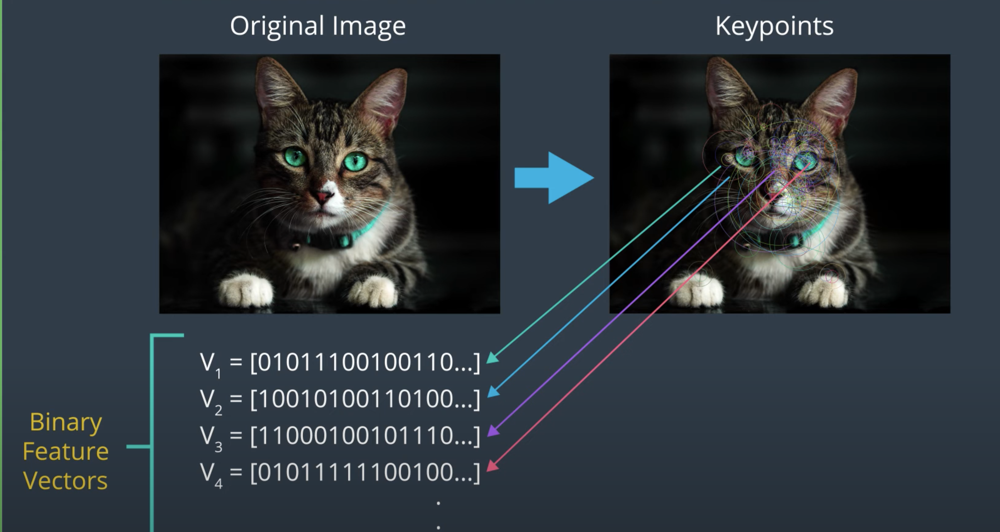

## ORB
- oriented fast and
- roated
- brief

## Keypoint
keypoint: small region in an image that is particularly distinctive. e.g corners where the pixel values sharply change from light to dark

ORB generated keypoints

once keypoints in an image have been located, ORB calculate correponding feature vector for each keypoint, only containing binary values.
The sequence of ones and zeros vary accordig to what a specific keypoint and its surrounding pixel area look like. The vector represnets the pattern of intensity around a key point.
So multiple feature vectors can be used to identiy a large area, and even a specific object in an image.
### FAST (Features from accelerated segments Test)
find keypoint in an image: [youtube](https://www.youtube.com/watch?v=DCHAc6fjcVM)
### BRIEF (Binary robost independent elementary features)
creat feature vectors from keypoint: [youtube](https://www.youtube.com/watch?v=EKIPEPpRciw)
- to handle object of diffrent scale and object orientation: [youtube](https://www.youtube.com/watch?v=2k3T6rfjvx0)
### Feature Matching
https://www.youtube.com/watch?v=RH05Wnl1-2A
- [limitation](https://www.youtube.com/watch?v=Vzs6B1dFQC0)
