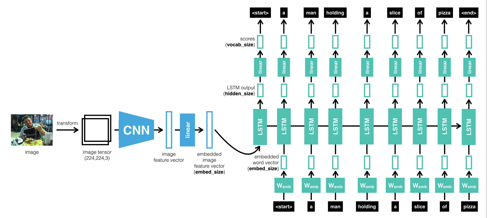

[original project github](https://github.com/udacity/CVND---Image-Captioning-Project)
## Reference Paper
[Show and Tell: A Neural Image Caption Generator](https://arxiv.org/pdf/1411.4555.pdf)

If you want to improve the model further you can check the resource mentioned below.
- [Automated Image Captioning with ConvNets and Recurrent Nets](https://cs.stanford.edu/people/karpathy/sfmltalk.pdf).
- [DenseCap: Fully Convolutional Localization Networks for Dense Captioning](https://cs.stanford.edu/people/karpathy/densecap/).

CNN-LSTM Architectures (in image captions):
- [Learning CNN-LSTM Architectures for Image Caption Generation](https://cs224d.stanford.edu/reports/msoh.pdf)
- [IMAGE CAPTIONING USING RNN AND LSTM.](https://kapilddatascience.wordpress.com/2017/01/07/image-captioning-using-rnn-and-lstm/)
- [What is the advantage of combining Convolutional Neural Network (CNN) and Recurrent Neural Network (RNN)?](https://www.quora.com/What-is-the-advantage-of-combining-Convolutional-Neural-Network-CNN-and-Recurrent-Neural-Network-RNN)

Use cases similar to the image captioning project :

- [Rich Image Captioning in the Wild](https://arxiv.org/abs/1603.09016)
- [VQA: Visual Question Answering](https://arxiv.org/abs/1505.00468v7)

Suggestion - I encourage you to validate your model in step 3 to check for overfitting and hyperparameter tuning. You can visualize the training, its always great to see your loss decreasing visually. You can use tensorboard to visualize these. Here is the link for tensorboard in pytorch: [VISUALIZING MODELS, DATA, AND TRAINING WITH TENSORBOARD](https://pytorch.org/tutorials/intermediate/tensorboard_tutorial.html)

## Keeping Your Session Active
The workspace_utils.py module (available here) includes an iterator wrapper called keep_awake and a context manager called active_session that can be used to maintain an active session during long-running processes. The two functions are equivalent, so use whichever fits better in your code.

```
from workspace_utils import keep_awake

for i in keep_awake(range(5)):  #anything that happens inside this loop will keep the workspace active
    # do iteration with lots of work here
```
```
from workspace_utils import active_session

with active_session():
    # do long-running work here
```

