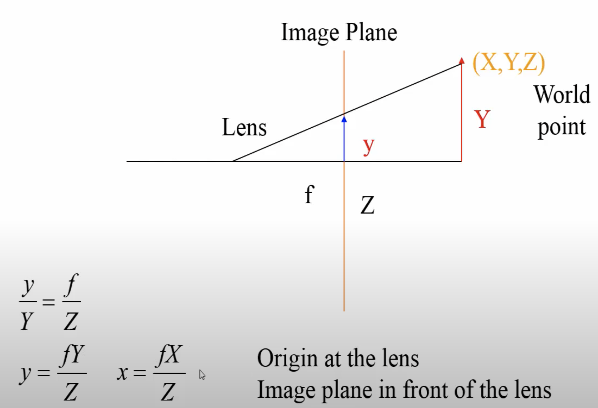

# TODO:
1. how to derive intrinsic parameter for cameras
2. how homogenous coordinates work in CV
3. how does least square fit solve the camera matrix?
4. practice camera calibration calculation
5. what is fundamental matrix and essential matrix.


# Camera Optics
## Camera Sensors
every camera pipeline use different algorithms. an example:
- sensor: ( hardwar sensor)
- analog to digital conversion (ADC): ( hardwar sensor)
- processing (hardwar processor chips): demosaicking, tone mapping&white balancing, denoising&sharpening, compression
- storage
## Camera Pixel
https://www.princetoninstruments.com/learn/camera-fundamentals/pixel-size-and-camera-resolution

A pixel is the part of a sensor which collects photons so they can be converted into photoelectrons. Multiple pixels cover the surface of the sensor so that both the number of photons detected, and the location of these photons can be determined.

Pixels come in many different sizes, each having their advantages and disadvantages. Larger pixels are able to collect more photons, due to their increase in surface area. This allows more photons to be converted into photoelectrons, increasing the sensitivity of the sensor. However, this is at the cost of resolution.

Smaller pixels are able to provide higher spatial resolution but capture less photons per pixel. To try and overcome this, sensors can be back-illuminated to maximize the amount of light being captured and converted by each pixel.

The size of the pixel also determines the overall size of the sensor. For example, a sensor which has 1024 x 1024 pixels, each with a 169 μm2 surface area, results in a sensor size of 13.3 x 13.3 mm. Yet, a sensor with the same number of pixels, now with a 42.25 μm2 surface area, results in a sensor size of 6.7 x 6.7 mm.
## Camera Resolution
https://www.princetoninstruments.com/learn/camera-fundamentals/pixel-size-and-camera-resolution
https://www.edn.com/digital-camera-design-determine-pixel-size-focal-ratio-and-field-of-view/


## Focal Length
The focal length of the lens describes the distance between the lens and the focused image on the sensor. As light passes through the lens it will either converge (positive focal length) or diverge (negative focal length), however within cameras the focal length is predominately positive. Shorter focal lengths converge the light more strongly (i.e. at a sharper angle) to focus the subject being imaged. Longer focal lengths, in comparison, converge the light less strongly (i.e. at a shallower angle) in order to focus the image.


the focal length of a lens is an optical property of the lens. It measures the distance, in millimetres, between the optical centre of the lens and the camera’s sensor (or film plane). It is determined with the camera focused to infinity. Lenses are named by their focal length, and you can find this information on the barrel of the lens. For example, a 50 mm lens has a focal length of 50 mm.
https://www.princetoninstruments.com/learn/camera-fundamentals/field-of-view-and-angular-field-of-view

The sensor size is determined by both the number of pixels on the sensor, and the size of the pixels. Different sized pixels are used for different applications, with larger pixels used for higher sensitivity, and smaller pixels used for higher spatial resolution (find out more on [Pixel Size and Camera Resolution](https://www.princetoninstruments.com/learn/camera-fundamentals/pixel-size-and-camera-resolution)).

## Field of View
Field of view (FOV) is the maximum area of a sample that a camera can image. It is related to two things, the focal length of the lens and the sensor size. Figure 1 shows a comparison between the field of view and the size of the sensor. Assuming that the focal length of the lens is the same, the larger the sensor the larger the field of view.


## Spatial resolution of display media
- pitch(distance between pixels on the center) = delta_x
- density = 1/delta_x

macbook air
- 900 pixels on 7'' high display
- delta_x = 7''/900 pixels = 0.0078''/pixel
- 1/delta_x = 129 dpi (dots per inch)

kindle2
- 900 pixels on 4.8'' high display
- 1/delta_x = 167 dpi

line printers are 300 dpi. This is why reading on laptop is not as enjoyable

## Linear Algebra used
1. linear transformation: a special transformation/function that keep **all** lines remain lines, and origin fixed. Grid lines remain parallel and evenly spaced
1. determinant of a linear transformation:
1. Cross products: https://www.youtube.com/watch?v=eu6i7WJeinw&t=99s


2. null space
3. SVD, singular value decomposition

Transpose means it is column vector

## Projective Geometry


## [single view methodology](https://www.cs.cmu.edu/~ph/869/papers/Criminisi99.pdf)
## Chapter 18. Camera Models and Calibration from learning-opencv-3
`cv::calibrateCamera()`

- a real pinhole is not a very good way to make images because it does not gather enough light for rapid exposure. This is why our eyes and cameras use lenses to gather more light than what would be available at a single point. The downside, however, is that gathering more light with a lens not only forces us to move beyond the simple geometry of the pinhole model but also introduces distortions from the lens itself
- camera calibration, to correct (mathematically) for the main deviations from the simple pinhole model that the use of lenses imposes on us. Camera calibration is also important for relating camera measurements to measurements in the real, three-dimensional world. The process of camera calibration gives us both a model of the camera’s geometry and a distortion model of the lens. These two informational models define the intrinsic parameters of the camera.
- Cx, Cy: The point at the intersection of the image plane and the optical axis is referred to as the principal point. You might think that the principal point is equivalent to the center of the imager, but this would imply that some guy with tweezers and a tube of glue was able to attach the imager in your camera to micron accuracy. In fact, the center of the imager chip is usually not on the optical axis. We thus introduce two new parameters, cx and cy, to model a possible displacement (away from the optic axis) of the center of coordinates on the projection screen.
- fx, fy:
    - You are probably used to thinking of the focal length in the context of lenses, in which case the focal length is a property of a particular lens, not the projection geometry. This is the result of a common abuse of terminology. It might be better to say that the “projection distance” is the property of the geometry and the “focal length” is the property of the lens. The f in the previous equations is really the projection distance. For a lens, the image is in focus only if the focus length of the configuration matches the focal length of the lens, so people tend to use the terms interchangeably.
    -  two different focal lengths; the reason for this is that the individual pixels on a typical low-cost imager are rectangular rather than square. The focal length fx, for example, is actually the product of the physical focal length of the lens and the size sx of the individual imager elements (this should make sense because sx has units of pixels per millimeter,5 while f has units of millimeters, which means that fx is in the required units of pixels). Of course, similar statements hold for fy and sy. It is important to keep in mind, though, that sx and sy cannot be measured directly via any camera calibration process, and neither is the physical focal length f directly measurable. We can derive only the combinations fx = F · sx and fy = F · sy without actually dismantling the camera and measuring its components directly. The point is that sx converts physical units to pixel units.
- With the ideal pinhole, we have a useful model for some of the three-dimensional geometry of vision. Remember, however, that very little light goes through a pinhole; thus, in practice, such an arrangement would make for very slow imaging while we wait for enough light to accumulate on whatever imager we are using. For a camera to form images at a faster rate, we must gather a lot of light over a wider area and bend (i.e., focus) that light to converge at the point of projection. To accomplish this, we use a lens. A lens can focus a large amount of light on a point to give us fast imaging, but it comes at the cost of introducing distortions.

Calibration Approach Taken by opencv: [Heikkila97] Heikkila, J., and O. Silven. “A four-step camera calibration procedure with implicit image correction,” Proceedings of the 1997 Conference on Computer Vision and Pattern Recognition (p. 1106), 1997.
## Lens Distortions
In theory, it is possible to define a lens that will introduce no distortions. In practice, however, no lens is perfect. This is mainly for reasons of manufacturing; it is much easier to make a “spherical” lens than to make a more mathematically ideal “parabolic” lens. It is also difficult to mechanically align the lens and imager exactly.
- The approach to modeling lens distortion taken here derives mostly from Brown [Brown71] and earlier Fryer and Brown [Fryer86].
    - [Brown71] Brown, D. C. “Close-range camera calibration,” Photogrammetric Engineering 37 (1971): 855–866.
    - [Fryer86] Fryer, J. G., and D. C. Brown. “Lens distortion for close-range photogrammetry,” Photogrammetric Engineering and Remote Sensing 52 (1986): 51–58.

We start with radial distortion. The lenses of real cameras often noticeably distort the location of pixels near the edges of the imager. This bulging phenomenon is the source of the “barrel” or “fisheye” effect (see the room-divider lines at the top of Figure 18-17 for a good example). Figure 18-3 gives some intuition as to why this radial distortion occurs. With some lenses, rays farther from the center of the lens are bent more than those closer in. A typical inexpensive lens is, in effect, stronger than it ought to be as you get farther from the center. Barrel distortion is particularly noticeable in cheap web cameras but less apparent in high-end cameras, where a lot of effort is put into fancy lens systems that minimize radial distortion.

For radial distortions, the distortion is 0 at the (optical) center of the imager and increases as we move toward the periphery. In practice, this distortion is small and can be characterized by the first few terms of a Taylor series expansion around r = 0.11 For cheap web cameras, we generally use the first two such terms; the first of which is conventionally called k1 and the second k2. For highly distorted cameras such as fisheye lenses, we can use a third radial distortion term, k3. In general, the radial location of a point on the imager will be rescaled according to the following equations


The second-largest common distortion is tangential distortion. This distortion is due to manufacturing defects resulting from the lens not being exactly parallel to the imaging plane;


Thus in total there are five distortion coefficients that we require. Because all five are necessary in most of the OpenCV routines that use them, they are typically bundled into one distortion vector; this is just a 5 × 1 matrix containing k1, k2, p1, p2, and k3 (in that order). Figure 18-6 shows the effects of tangential distortion on a front-facing external rectangular grid of points. The points are displaced elliptically as a function of location and radius.


### Calibration
Jean-Yves Bouguet’s calibration [website](http://www.vision.caltech.edu/bouguetj/calib_doc/).

```
cv::calibrateCamera()
```
In this routine, the method of calibration is to target the camera on a known structure that has many individual and identifiable points. By viewing this structure from a variety of angles, we can then compute the (relative) location and orientation of the camera at the time of each image as well as the intrinsic parameters of the camera
## OpenCV APIs
```
void cv::convertPointsToHomogeneous(
  cv::InputArray  src,        // Input vector of N-dimensional points
  cv::OutputArray dst         // Result vector of (N+1)-dimensional points
);

void cv::convertPointsFromHomogeneous(
  cv::InputArray  src,        // Input vector of N-dimensional points
  cv::OutputArray dst         // Result vector of (N-1)-dimensional points
);
```


## Camera calibration
https://www.youtube.com/watch?v=ZNHRH00UMvk
When you know the camera transform from the object, you can describe the camera model as:


It is 4x4 matrix. Ch3 is not used since image is 2d, since we have 12 unkowns.
- x= Ch1/Ch4
- y = Ch2/Ch4
but when you do not know, you can find the model matrix by the correspondence of 3D and 2D points. this is camera calibration

### How to determine camera matrix?
- select some known 3D points (X,Y,Z) and find their corresponding image points (x,y)
-  solve for camera matrix elements using least sqaures fit


if using N pair of points, we get matrix multiplication, but this is a homogenous system, there is no unique solutions since right side is 0:

select a44=1, so we have 11 unkowns and a new equation:


D is 2n x 11, D^TD will be 11 x 11, a square matrix:

Find the camera location:

Find the camera orientation:
when you move the object closer to lens, the object wil get bigger until it is at the location of the lens, when it will become very large (infinite). The only time the projected image become infinite is when Ch4=0. So we get this X,Y,Z plane equation. Since the object is at lense, it is the plane of camera

example application:
- [Recovering the Camera Parameters from a Transformation Matrix]: can't find access
- [Chapter 5: Recovering Camera Parameters](https://www.iro.umontreal.ca/~poulin/fournier/theses/Li.msc.pdf)


## Camera Parameters
- Extrinsic parameters(from world to camera): that define the location and orientation of the camera reference frame with respect to a known world reference frame
    - 3D translation vector
    - A 3x3 rotation matr5ix
here, T is translation matirx and R is rotation. Pc combines T and R and calls it extrinsic matrix


- intrinsic parameters(from camera to image): necessary to link the pixel coornidates of an image point with the corresponding coordinates in the camera reference frame
    - perspective projection (focal length): horizontal fx and vertical fy focal lengths
    - transformation between camera frame coordinates and pixel coordinates: translation ox and oy

here we move the image plan in front of the lens just so we do not use minus signs.




from camera to image coordinates:

now we have a complete camera model with intrinsic parameter as left matrix, multipled by extrinsic parameter as right matrix.


to get rid of Sx, we use fx as effective focal length expressed in effective horizontal pixel size

To compute this fianl camera parameters, use known 3D points and corresponding image points, estimate camera matrix employing pseudo inverse method of section 1.6 in fundamental of computer vision


As soon as you move or change the camera , you need to calculate the new camera matrix, the intrinsic may not change if focal length not changed, but the ext rotation and tranlastion is changed

[Flexible Camera Calibration By Viewing a Plane From Unknown Orientations](http://www.vision.caltech.edu/bouguetj/calib_doc/papers/zhan99.pdf)
# Resectioning
numerical methods for estimating the camera projection matrix
from corresponding 3-space and image entities. This computation of the camera matrix
is known as resectioning
# Camera projections
image formation, namely the
formation of a two-dimensional representation of a three-dimensional world,and what
we may deduce about the 3D structure of what appears in the images.

The drop from three-dimensional world to a two-dimensional image is a projection
process in which we lose one dimension. The usual way of modelling this process is
by central projection in which a ray from a point in space is drawn from a 3D world
point through a fixed point in space, the centre of projection. This ray will intersect a
specific plane in space chosen as the image plane. The intersection of the ray with the image plane represents the image of the point. If the 3D structure lies on a plane then
there is no drop in dimension
`
## homogeneous coordinates
[youtube](https://www.youtube.com/watch?v=q3turHmOWq4) <br>
They have the advantage that the coordinates of points, including points at infinity, can be represented using finite coordinates. Formulas involving homogeneous coordinates are often simpler and more symmetric than their Cartesian counterparts.
If homogeneous coordinates of a point are multiplied by a non-zero scalar then the resulting coordinates represent the same point.
The origin point (0,0,0) is the center of projection.


This has two benefits:
- by adding one dimension, it makes all points passing through the origin, and thus linear transform. Why?
    - make an affine problem linear by turning every point in the affine space into a line that passes through the origin. Lines that pass through the origin are linear.
- can easily represent points at infinity. by setting the value of k to zero. e.g if the ideal polint is given as (3,2,0), this tells us we have a point at infinity in the direction (3,2).  3/0 = infinity

Doe homogeneous coordinates loses rigid body preservations? Remember that rigid body transformations preserves angles and magnitudes but projective does not. The answer is no. We get away with it because while the homogeneous coordinates are a projection, they are a projection from a higher dimension. Projective preserves straight lines. The straight lines are all we require to get back to the lower dimensions.


Here camera coords means where the world points are relative to our camera, still 3D points;
pixel coords: some points fall out of image sensors, some fall inside the sensors, we need to decide how big are the coordinates and where exactly do they fall, and where is the 2-demensional origin, it is not necessairly in the centor or image sensor, more popurlarly it is the corner


This is also called SLAM


## Geometric Camera Calibration
see book CV: amodern approach section 1.2
composed of 2 transformations:
- Extrinsic parameters (or camera pose): from some (arbitrary) world coordinate system to the camera's 3D coordinate system
- intrinsic parameters: from the 3D coornidates in the camera frame to the 2D image plane via projection

- [rotation matrix](https://www.youtube.com/watch?v=y4yznOIjVKY)
- put it together: rigid transformation [1](https://www.youtube.com/watch?v=ExJGbBBYqGI), [2](https://www.youtube.com/watch?v=WkGSYJm2_kk)

- [Ideal vs Real Intrinsic Parameters](https://www.youtube.com/watch?v=LOsh7-TEUq8)
- [Improving Intrinsic Parameters](https://www.youtube.com/watch?v=hu4KvYWvqTc)
- [combine in and ex](https://www.youtube.com/watch?v=N8kJD0KjrNc)
- [full camera calibration matrix](https://www.youtube.com/watch?v=CfphDyxj0yo)

Calibrating cameras:
- Direct Linear Calibration Homogeneous: [1](https://www.youtube.com/watch?v=fTMIi1H7JNs), [2](https://www.youtube.com/watch?v=u0s1ac8UrK8)
    - solutions: [svd-1](https://www.youtube.com/watch?v=LVdX3242g3o), [svd-2](https://www.youtube.com/watch?v=nBN4QBQuvD8), [svd-3](https://www.youtube.com/watch?v=ZYymYKbyLPE)
- [Direct Linear Calibration Inhomogeneous](https://www.youtube.com/watch?v=wWyCzATxR9g)
- [pros and cons of direct linear calibration](https://www.youtube.com/watch?v=FcFAdak3X9A)
- [Geometric Error](https://www.youtube.com/watch?v=kPRvB7XKjtk)
- finding the 3D camera center from M:
    - [the pure way](https://www.youtube.com/watch?v=mEdvnowU3jY)
    - [the easy way](https://www.youtube.com/watch?v=3-rdIiLkGrw)
- [multi plane calibration](https://www.youtube.com/watch?v=EhxxcFFx_7g): it is most popular since code to calibrate is online


## Degree of Freedom
- [rigid body](https://www.youtube.com/watch?time_continue=1&v=H5gSlSWjt0s&feature=emb_logo)
- [how many DoF in 3x4 extrinsic parameter matrix](https://www.youtube.com/watch?v=00H6sqvHKCI)
## Distortion
The pin hole camera model is certainly a very good approximation but as we know most cameras use lenses to gather more light. How much do these differ from the pinhole model? well firstly, with a lens, not everything is in focus. Secondly there are all sorts of distortions which can affect the image.

More materials:
- [Stanford marc levoy  CS 178 - Digital Photography](https://graphics.stanford.edu/courses/cs178-13/)
    - [youtube](https://www.youtube.com/watch?v=Y6kwPir0uMM&list=RDCMUC1pHWlSHjk0mJ5qOo7JhQbg&start_radio=1&rv=Y6kwPir0uMM&t=10)
    - https://www.eecis.udel.edu/~arce/files/Courses/DigImgProc/optics1-30mar16.key.pdf
    - [limitation of lens](https://graphics.stanford.edu/courses/cs448a-10/optics2-12jan10-opt.pdf)
- [Book eugene Hecht's Optics](https://drive.google.com/file/d/1C64koy8oiWbU4D87pef2IdI4iwcvKM4d/view?usp=sharing)

### Radial Distortion

## Camera matrix
the 3x4 matrix P that map 3D world in terms of homogeneous coordinates to 2D projective plan with homogeneous coordinates
## projective ambiguity
the point Xi projects to the two given data points.
However, neither the cameras (represented by projection matrices P and P
 ), nor the
points Xi are known. It is our task to determine them.
It is clear from the outset that it is impossible to determine the positions of the points
uniquely. it turns out that unless
something is known about the calibration of the two cameras, the ambiguity in the
reconstruction is expressed by a more general class of transformations – projective
transformations
This ambiguity arises because it is possible to apply a projective transformation (represented
by a 4   4 matrix H) to each point Xi, and on the right of each camera matrix
Pj , without changing the projected image points,


There is no compelling reason to choose one set of points and camera matrices over the
other. The choice of H is essentially arbitrary, and we say that the reconstruction has a
projective ambiguity, or is a projective reconstruction.
However, the good news is that this is the worst that can happen. It is possible to
reconstruct a set of points from two views, up to an unavoidable projective ambiguity.


The basic tool in the reconstruction of point sets from two views is the fundamental
matrix, which represents the constraint obeyed by image points x and x  if they are
to be images of the same 3D point. This constraint arises from the coplanarity of the
camera centres of the two views, the images points and the space point
## Epipolar Geometry
epipolar plane: https://www.crcv.ucf.edu/wp-content/uploads/2019/03/Lecture-13-FundamentalMatrix.pdf

## Two View Reconstruction/Stereo system
- [A simple Stereo System](https://www.youtube.com/watch?v=3hivcpmV9IE)
- [Stereo Disparity](https://www.youtube.com/watch?v=1eQAIl0zPWQ)
- [search for correspondence](https://www.youtube.com/watch?v=D6fDQTvqiV4)\
- [RGBD](https://www.youtube.com/watch?v=6ABh4j4oei4)

## Photometry to Geometry

# Video Resources
- [Linear Algebra OCW](https://www.youtube.com/watch?v=YrHlHbtiSM0&list=PLUl4u3cNGP61iQEFiWLE21EJCxwmWvvek)
- [MIT 18.06SC Linear Algebra, Fall 2011](https://www.youtube.com/watch?v=7UJ4CFRGd-U&list=PL221E2BBF13BECF6C)

- [Lecture: Multiple View Geometry (Prof. D. Cremers)](https://www.youtube.com/playlist?list=PLTBdjV_4f-EJn6udZ34tht9EVIW7lbeo4)
- [Sean Mullery Multiple View Geometry in Computer Vision](https://www.youtube.com/playlist?list=PLyH-5mHPFffFvCCZcbdWXAb_cTy4ZG3Dj)
- [mubarak shah UCF CRCV ](https://www.youtube.com/watch?v=K-j704F6F7Q&list=RDCMUClOghZ_xkI1km31IeoY-9Bw&start_radio=1&rv=K-j704F6F7Q&t=2)
    - [book: fundamentals of computer vision](http://crcv.ucf.edu/gauss/BOOK.PDF)
    - [computervision16](https://www.cs.ucf.edu/~bagci/teaching/computervision16.html)
    - [other materials](https://www.cs.ucf.edu/~bagci/teaching/)

- [Stanford Computer Vision](https://www.youtube.com/playlist?list=PLf7L7Kg8_FNxHATtLwDceyh72QQL9pvpQ)

- [stanford Digital Photograph](https://www.youtube.com/watch?v=Y6kwPir0uMM&list=RDCMUC1pHWlSHjk0mJ5qOo7JhQbg&start_radio=1&rv=Y6kwPir0uMM&t=10)
