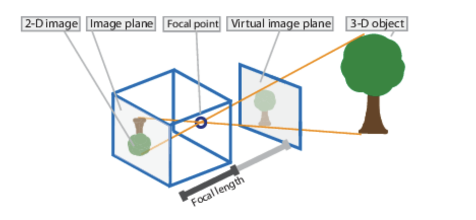
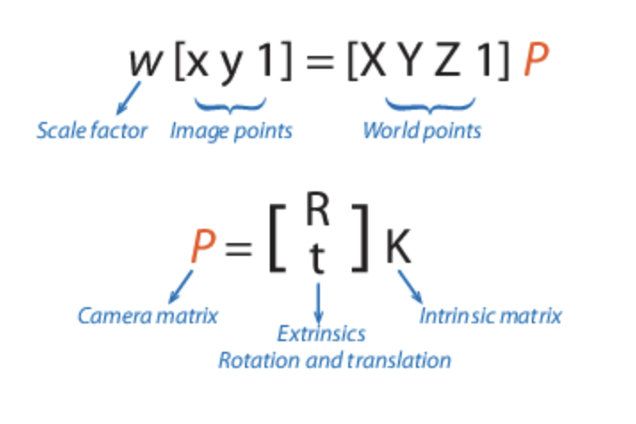
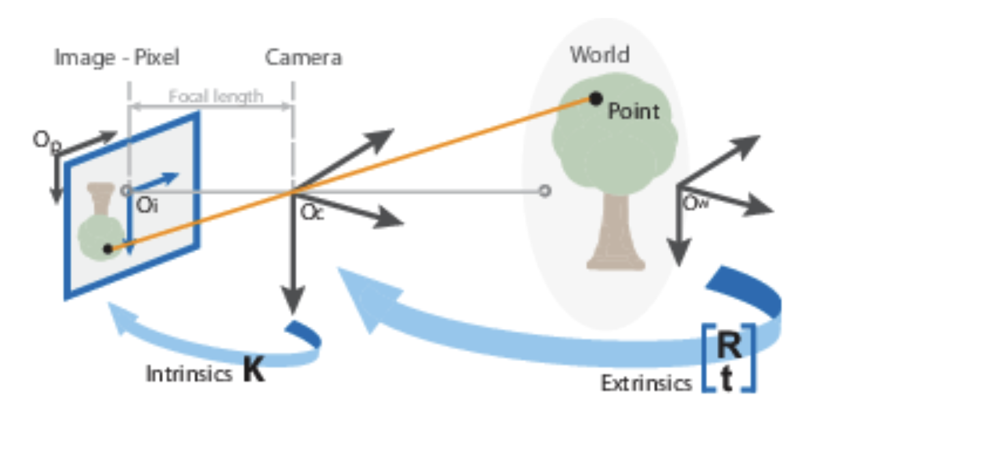

# Pose Estimation
Given 3D model of object, and its image (2D projection) determine the location and orientation(translation & rotation) of object such that when projected on the image plane it will match with the image **of both the object and the camera**

relate different coordinate system
- world coordinate
- robot location
- camera coordinate

## Camera calibration
https://www.analyticsvidhya.com/blog/2021/10/a-comprehensive-guide-for-camera-calibration-in-computer-vision/

The camera is often categorized on the basis of a set of intrinsic parameters such as skew of the axis, focal length, and main point in these applications, and its orientation is expressed by extrinsic parameters such as rotation and translation. Linear or nonlinear algorithms are used to estimate intrinsic and extrinsic parameters utilizing known points in real-time and their projections in the picture plane.

Camera calibration can be defined as the technique of estimating the characteristics of a camera. It means that we have all of the camera’s information like parameters or coefficients which are needed to determine an accurate relationship between a 3D point in the real world and its corresponding 2D projection in the image acquired by that calibrated camera

The pinhole calibration algorithm is based on  ’s [3] model. The pinhole camera model and lens distortion are included in the model. Because an ideal pinhole camera does not have a lens, the pinhole camera model does not account for lens distortion. To accurately simulate a genuine camera, the algorithm’s whole camera model incorporates radial and tangential lens distortion.

The camera matrix is a 4-by-3 matrix that represents the pinhole camera specifications. The image plane is mapped into the image plane by this matrix, which maps the 3-D world scene. Using the extrinsic and intrinsic parameters, the calibration algorithm computes the camera matrix. The extrinsic parameters represent the camera’s position in the 3-D scene. The intrinsic characteristics represent the camera’s optical center and focal length.

The world points are transformed to camera coordinates using the extrinsic parameters. Intrinsic parameters are used to map the camera coordinates into the image plane.

1. Intrinsic or Internal Parameters
It allows mapping between pixel coordinates and camera coordinates in the image frame. E.g. optical center, focal length, and radial distortion coefficients of the lens.

2. Extrinsic or External Parameters
It describes the orientation and location of the camera. This refers to the rotation and translation of the camera with respect to some world coordinate system.

## Fisheye
A fisheye lens is an ultra wide-angle lens that produces strong visual distortion intended to create a wide panoramic or hemispherical image.[4][5]: 145  Fisheye lenses achieve extremely wide angles of view. Instead of producing images with straight lines of perspective (rectilinear images), fisheye lenses use a special mapping (for example: equisolid angle), which gives images a characteristic convex non-rectilinear appearance.

## different methods
- Toshev et al. use their network to directly regress the x,y coordinates of joints.
- The work by Tompson et al. [ Joint training of a convolutional network and a graphical model for human pose estimation] instead generates heatmaps by running an image through multiple resolution banks in parallel to simultaneously capture features at a variety of scales. We use a Mean Squared Error (MSE) criterion to minimize the distance between the predicted output and a target heat-map. The target is a 2D Gaussian with a small variance and mean centered at the ground-truth joint locations. At training time we also perform random perturbations of the input images (randomly flipping and scaling the images) to increase generalization performance.
## Baseline For Human Pose Estimation
what is deconvolution? Transposed convolutions – also called fractionally strided convolutions or
deconvolutions1 – work by swapping the forward and backward passes of a convolution.
One way to put it is to note that the kernel defines a convolution, but
whether it’s a direct convolution or a transposed convolution is determined by
how the forward and backward passes are computed

- [A guide to convolution arithmetic for deep
learning](https://arxiv.org/pdf/1603.07285.pdf)
- [Transposed convolution animations](https://github.com/vdumoulin/conv_arithmetic/blob/master/README.md)
- [Is the deconvolution layer the same as a convolutional layer?](https://arxiv.org/pdf/1609.07009.pdf). The original paper talks about improving the resolution of an image by upsampling the image with Transposed Convolution from the low resolution space, and also examines and compares there method on sub-pixel convolution.

why Deconvolution?
- it is arguably the simplest to generate heatmaps from deep and low resolution features and also adopted in the state-of-the-art Mask R-CNN (from Simple Baselines for Human Pose Estimation and Tracking)
- Both works Hourglass and CPN use upsampling to increase the feature map resolution and put convolutional parameters in other blocks. In contrary, our method combines the upsampling and convolutional parameters into deconvolutional layers in a much simpler way, without using skip layer connections.

A commonality of the three methods is that three upsampling steps and also
three levels of non-linearity (from the deepest feature) are used to obtain high-
resolution feature maps and heatmaps. Based on above observations and the
good performance of our baseline, it seems that obtaining high resolution feature
maps is crucial, but no matter how.
### Heatmap
what? a per-pixel likelihood for key joint locations on the human skeleton.

why heatmap? Mean Squared Error (MSE) is used as the loss between
the predicted heatmaps and targeted heatmaps. The targeted heatmap H^k for
joint k is generated by applying a 2D gaussian centered on the kth joint's ground
truth location.
    - [Joint training of a convolutional network and a graphical model for human pose estimation](https://arxiv.org/abs/1406.2984): A critical feature is the joint use of a ConvNet and a graphical model. Their graphical model learns typical spatial relationships between joints. Discriminative deep-learning approaches learn an empirical
set of low and high-level features which are typically more tolerant to variations in the training set
and have recently outperformed part-based models [27]. However, incorporating priors about the
structure of the human body (such as our prior knowledge about joint inter-connectivity) into such
networks is difficult since the low-level mechanics of these networks is often hard to interpret.
    - [Stacked hourglass networks for human pose estimation](https://arxiv.org/abs/1603.06937)

- [Cascaded pyramid network for multi-person pose estimation](https://arxiv.org/abs/1711.07319)
## Pose estimation from multi-view input images
- Early attempts tackled pose-estimation from multiview
inputs by optimizing simple parametric models of the
human body to match hand-crafted image features in each
view, achieving limited success outside of the controlled
settings.
    - [Markerless motion capture of interacting characters using multi-view image segmentation](https://ieeexplore.ieee.org/document/5995424)
    - [Optimization and filtering for human motion
capture](https://www.tnt.uni-hannover.de/papers/data/611/611_1.pdf)
    - [3d pictorial structures for multiple view articulated pose estimation](https://ieeexplore.ieee.org/document/6619308)
    - [3d pictorial structures for multiple human pose estimation.](https://ieeexplore.ieee.org/document/6909612)
- With the advent of deep learning, the dominant
paradigm has shifted towards estimating 2D poses from
each view separately, through exploiting efficient monocular
pose estimation architectures, and then
recovering the 3D pose from single view detections.
    - [Stacked hourglass networks for human pose estimation](https://arxiv.org/abs/1603.06937)
    - [Efficient object localization using
convolutional networks](https://arxiv.org/abs/1411.4280)
    - [Convolutional pose machines](https://arxiv.org/pdf/1602.00134.pdf)
    - [Deep high-resolution representation learning for human pose estimation](https://arxiv.org/pdf/1902.09212.pdf)

- Few models have focused on developing lightweight
solutions to reason about multi-view inputs
    - [A generalizable approach for multi-view 3d human pose regression](https://arxiv.org/abs/1804.10462) proposes to concatenate together pre-computed 2D
detections and pass them as input to a fully connected
network to predict global 3D joint coordinates
    - [Cross view fusion for 3d human pose estimation](https://arxiv.org/abs/1909.01203) refines 2D heatmap detections jointly by using a fully
connected layer before aggregating them on 3D volumes.
- these methods
fuse information from different views without using
volumetric grids, they do not leverage camera information
and thus overfit to a specific camera setting. We will show
that our approach can handle different cameras flexibly and
even generalize to unseen ones.
### Multi-view and competing techniques
Multi-view pose estimation is arguably the best way to obtain ground truth
for monocular 3D pose estimation [5, 22] in-the-wild

- [5] [Panoptic studio: A massively
multiview system for social interaction capture]()
- [22] [Humbi 1.0: Human multiview behavioral imaging dataset]()

Competing techniques have certain limitations such as inability to capture rich pose
representations (e.g. to estimate hands pose and face pose
alongside limb pose) as well as various clothing limitations.:
- marker-based motion capture: [A survey of
advances in vision-based human motion capture and analysis.
Computer vision and image understanding]()
- visual-inertial methods: [Human
pose estimation from video and imus.]()

The downside is, previous works that used multi-view triangulation for constructing datasets relied on excessive, almost impractical number of views to get the 3D ground truth of sufficient quality [5, 22]. This makes the collection of
new in-the-wild datasets for 3D pose estimation very challenging and calls for the reduction of the number of views needed for accurate triangulation.

improving the accuracy
of multi-view pose estimation from few views is an
important challenge with direct practical applications.

Studies of multiview 3D human pose estimation are generally aimed at getting
the ground-truth annotations for the monocular 3D human
pose estimation: [Learning Monocular 3D Human Pose Estimation from Multi-view Images](https://arxiv.org/pdf/1803.04775.pdf)

The work [A generalizable approach for multi-view 3D human pose regression](https://arxiv.org/abs/1804.10462) proposed concatenating joints’ 2D coordinates from all views into a single
batch as an input to a fully connected network that is
trained to predict the global 3D joint coordinates. This approach
can efficiently use the information from different
views and can be trained on motion capture data. However,
the method is by design unable to transfer the trained
models to new camera setups, while the authors show that
the approach is prone to strong over-fitting.

### Monocular(Single view) 3D pose estimation
1. using high quality 2D pose estimation engines with subsequent
separate lifting of the 2D coordinates to 3D via deep neural
networks (either fully-connected, convolutional or recurrent): [A simple
yet effective baseline for 3d human pose estimation](https://arxiv.org/abs/1705.03098). It offers several advantages:
it is simple, fast, can be trained on motion capture
data (with skeleton/view augmentations) and allows switching
2D backbones after training. Despite known ambiguities
inherent to this family of methods (i.e. orientation of
arms’ joints in current skeleton models), this paradigm is
adopted in the current multi-frame state of the art [3d
human pose estimation in video with temporal convolutions
and semi-supervised training](https://arxiv.org/pdf/1811.11742.pdf)
2. infer the 3D coordinates directly
from the images using convolutional neural networks. The
present best solutions use volumetric representations of the
pose, with current single-frame state-of-the-art results on
Human3.6M, namely [Integral human pose regression](https://arxiv.org/pdf/1711.08229.pdf).
### the idea of learnable triangulation
We propose and investigate two simple
and related methods for multi-view human pose estimation. Behind both of them lies the idea of learnable trangulation, which allows us to dramatically reduce the number of views needed for accurate estimation of 3D pose. During learning, we either use marker based motion capture ground truth or “meta”-ground truth obtained from the excessive number of views

The methods themselves are as follows:
- (1) a simpler approach based on algebraic triangulation with learnable camera-joint confidence weights, and
- (2) a more complex volumetric triangulation approach based on dense geometric aggregation of information from different views that allows modelling a human pose prior.  Crucially, both of the proposed solutions are fully differentiable, which permits
end-to-end training.
### Triangulating 2D detections
Computing the position of a point in 3D-space given its images in n views
and the camera matrices of those views is one of the most studied computer vision problems.
- refer to book [Multiple view geometry in computer vision](https://drive.google.com/file/d/1IcfX9ODlmKlHOxta8de2tsLwfNT3x7tR/view?usp=sharing)

In our work,
we use the Direct Linear Triangulation (DLT) method
because it is simple and differentiable. We propose a novel
GPU-friendly implementation of this method, which is up
to two orders of magnitude faster than existing ones that are
based on SVD factorization. We provide a more detailed
overview about this algorithm in Section 7.2
- Several methods lift 2D detections efficiently to 3D by
means of triangulation
    - [Multi-view pictorial structures for 3d human
pose estimation.]
    - [3d pose detection of closely interactive humans using multiview
cameras]
    - [Deepfly3d: A deep
learning-based approach for 3d limb and appendage tracking
in tethered, adult drosophila]
    - [Realtime multi-person 2d pose estimation using part affinity
fields]
- More closely related to
our work, [Learnable triangulation of human pose](https://arxiv.org/abs/1905.05754) proposes to back-propagate through an SVDbased
differentiable triangulation layer by lifting 2D detections
to 3D keypoints. Unlike our approach, these methods
do not perform any explicit reasoning about multi-view inputs
and therefore struggle with large self-occlusions.
# Concepts
1. Basic idea is treating the latent space as 3D point cloud​. what is 3D point cloud?
3. 2D detction can be simply lifted to 3D absolute coordinates by means of triangulation. e.g DLT triangulation.
4. self-occlusions
5. feature transform layers (FTL), which was originally proposed as a technique to condition latent embeddings on a target transformation so that to learn interpretable representations.: [Interpretable transformations with encoder-decoder networks](https://arxiv.org/abs/1710.07307)
6. Direct Linear Transformation
7. lift 2D detections to 3D by means of triangulation
8. Canonical Fusion: jointly reason across views, leveraging the observation that the 3D pose information contained in feature maps fzigni =1 is the same across all n views up to camera projective transforms and occlusions, as discussed above.
# Evaluation
- [Simple baselines for human pose estimation and tracking](https://arxiv.org/pdf/1804.06208.pdf)
# Methods
## Lightweight Multi-View 3D Pose Estimation through Camera-Disentangled Representation
We first propose **a baseline approach** to estimate the 3D pose from multi-view inputs , similar to :
- 3d pose detection of closely interactive humans using multiview cameras
- Deepfly3d: A deep learning-based approach for 3d limb and appendage tracking in tethered, adult drosophila.

Here, we simply decode latent codes zi to 2D detections, and lift 2D
detections to 3D by means of triangulation. We refer to this
approach as Baseline. Although efficient, we argue that this
approach is limited because it processes each view independently
and therefore cannot handle self-occlusions.

An intuitive way to jointly reason across different views
is to use a learnable neural network to share information
across embeddings, by concatenating features from
different views and processing them through convolutional
layers into view-dependent features. similar to
- A generalizable approach for multi-view 3d human pose regression
- Cross view fusion for 3d human pose estimation.

refer to this general
approach as Fusion. Although computationally lightweight
and effective, we argue that this approach is limited for two
reasons:
(1) it does not make use of known camera information,
relying on the network to learn the spatial configuration
of the multi-view setting from the data itself, and
(2)
it cannot generalize to different camera settings by design.

### Learning a view independent representation
To alleviate the aforementioned limitations, we propose
a method to jointly reason across views, leveraging the observation
that the 3D pose information contained in feature
maps  is the same across all n views up to camera
projective transforms and occlusions, as discussed above.
We will refer to this approach as Canonical Fusion.
- feature transform layers (FTL）： In this work, we
leverage FTL to map images from multiple views to a unified
latent representation of 3D pose. In particular, we use
FTL to project feature maps zi to a common canonical representation
by explicitly conditioning them on the camera
projection matrix P  1
i that maps image coordinates to the world coordinates

# Synthesis
- FTL: Several approaches have used FTL for novel view synthesis
to map the latent representation of images or poses
from one view to another
    - [Unsupervised
geometry-aware representation for 3d human pose
estimation]
    - [Neural scene decomposition
for multi-person motion capture.]
    - [Monocular neural
image based rendering with continuous view control.]
    - [Weakly-supervised discovery of geometry-aware
representation for 3d human pose estimation]

# Open Techniques
- [MediaPipe](https://google.github.io/mediapipe/solutions/pose.html)

# Dataset
- Human3.6M: [Human3.6m:
Large scale datasets and predictive methods for 3d
human sensing in natural environments]
- CMU Panoptic : [Panoptic studio: A massively
multiview system for social interaction capture]
- Total capture: 3d human
pose estimation fusing video and inertial sensors

# Questions & TODO
1. what is the evaluation metrics for open dataset? is it evaluating on 3D coordinates or 2D?
2. does other methods also evaluate on 3D coordinates?

TODO:
2. read code now
    - det and DPE transition
    - DPE processing pipeline in C++
    - DPE model
0. synthetic data
0. read TDG again with P's notebook help
0. read H's sharings
1. read slides again see if you can understand
2. what metrics are used in DPE training/eval?
