## Papers
- [LookinGood: Enhancing Performance Capture with Real-time Neural Re-Rendering](https://arxiv.org/abs/1811.05029)
- [Project Starline: A high-fidelity telepresence system](https://storage.googleapis.com/pub-tools-public-publication-data/pdf/424ee26722e5863f1ce17890d9499ba9a964d84f.pdf)
# Basics
## Radiometry and reflectance
To interpret image intensities
- 2D angle, radian = dl/r
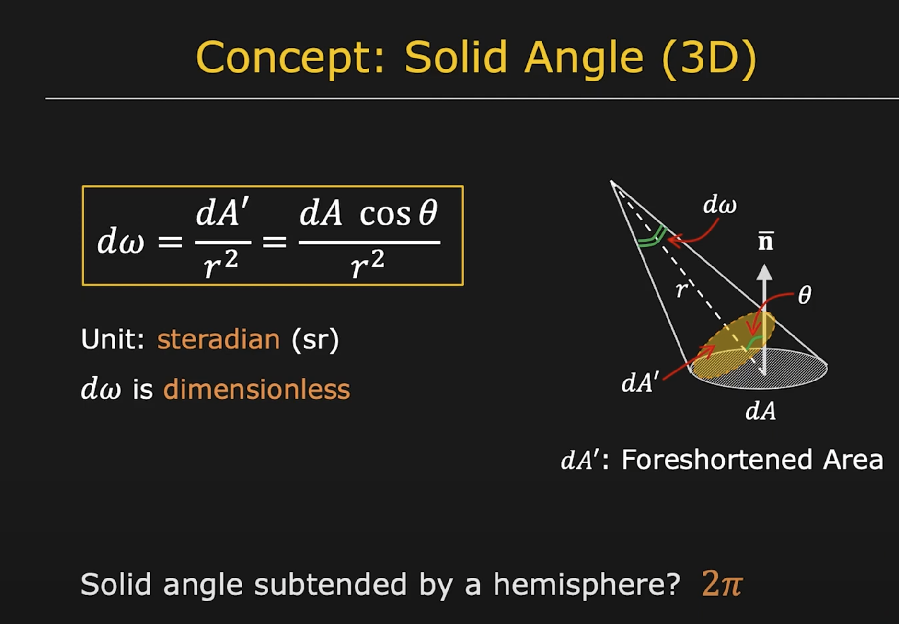
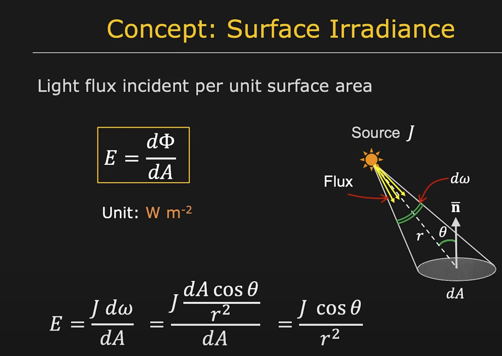
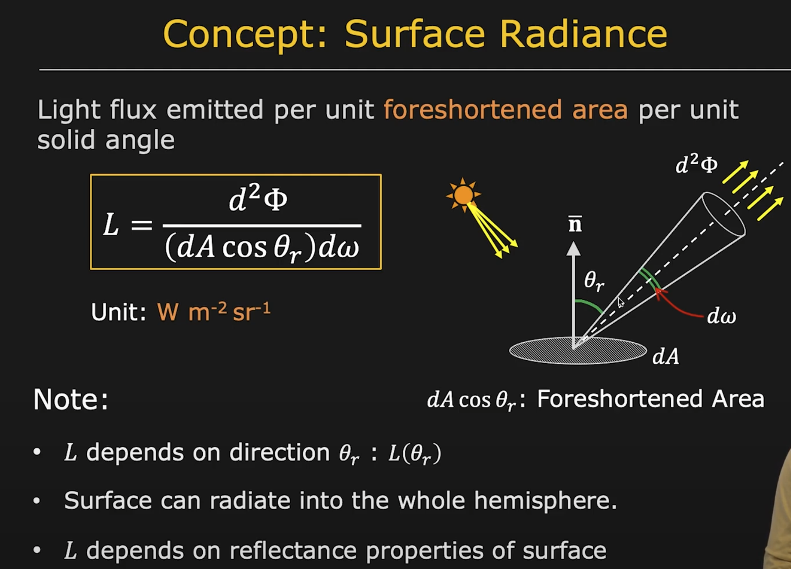
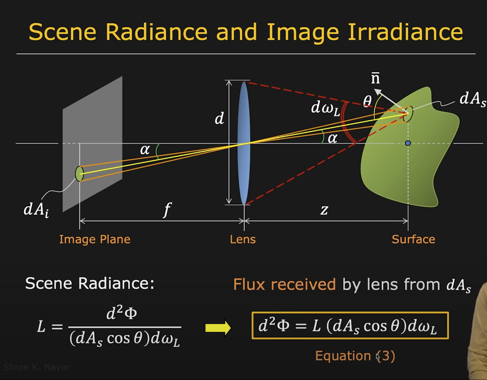
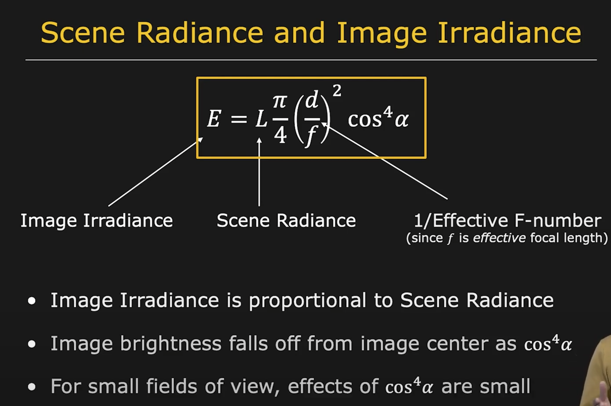
## material, surface reflectance
bidirectional reflectance distribution: surface reflection depends on both the viewing and illumination directions
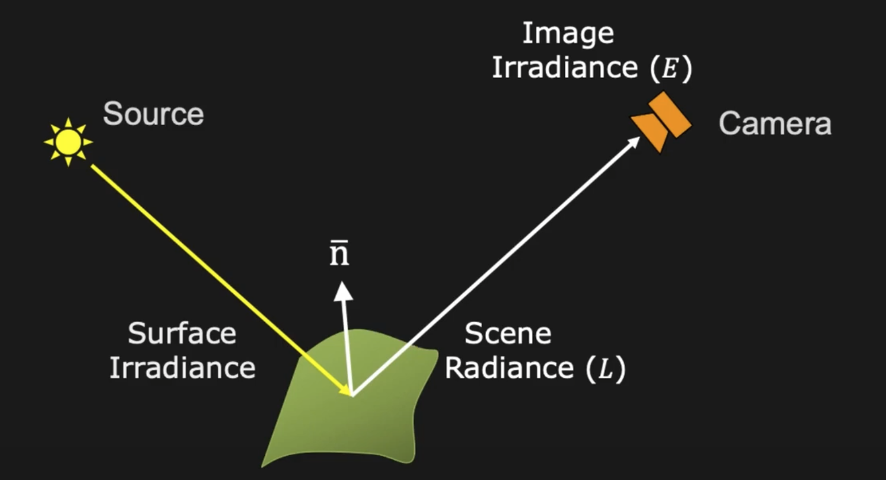
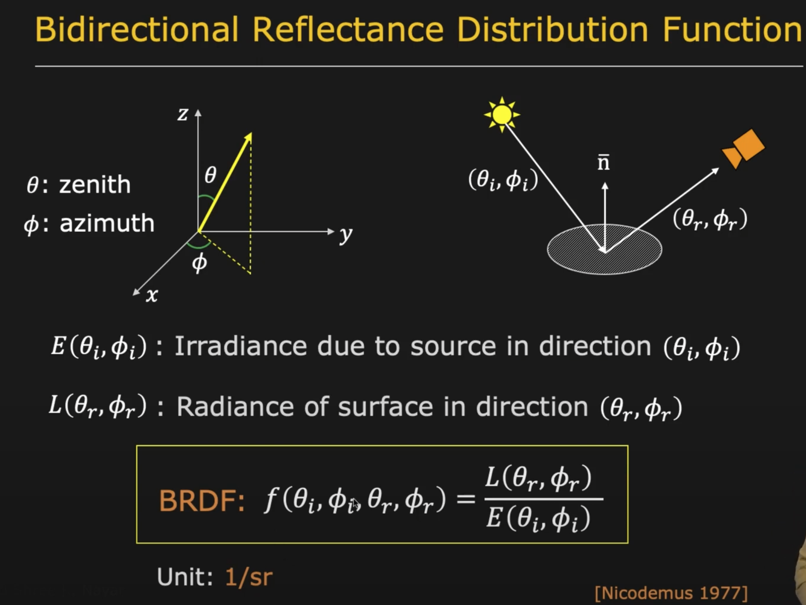
## reflection models
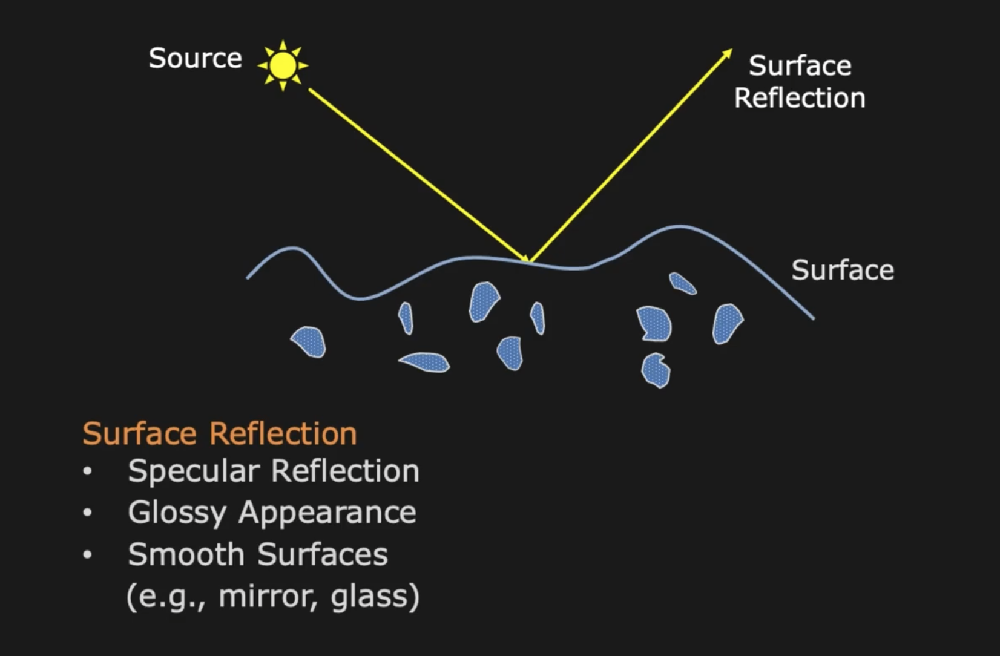
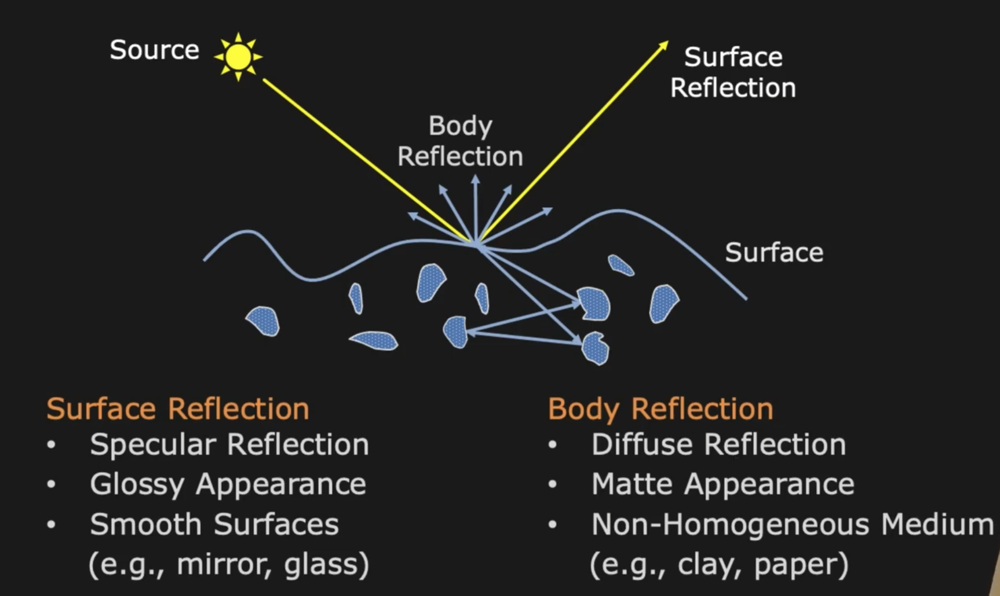
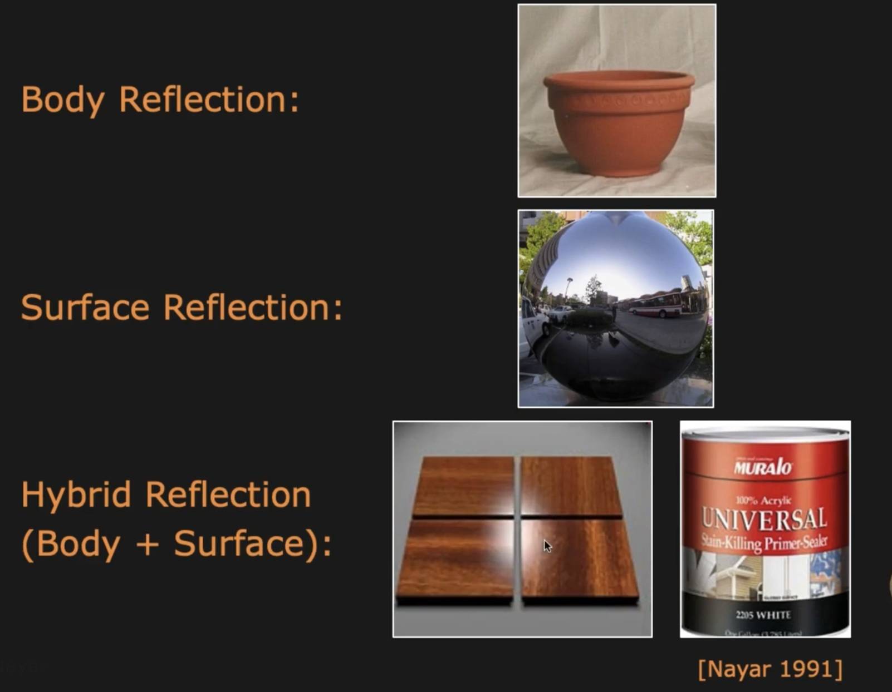
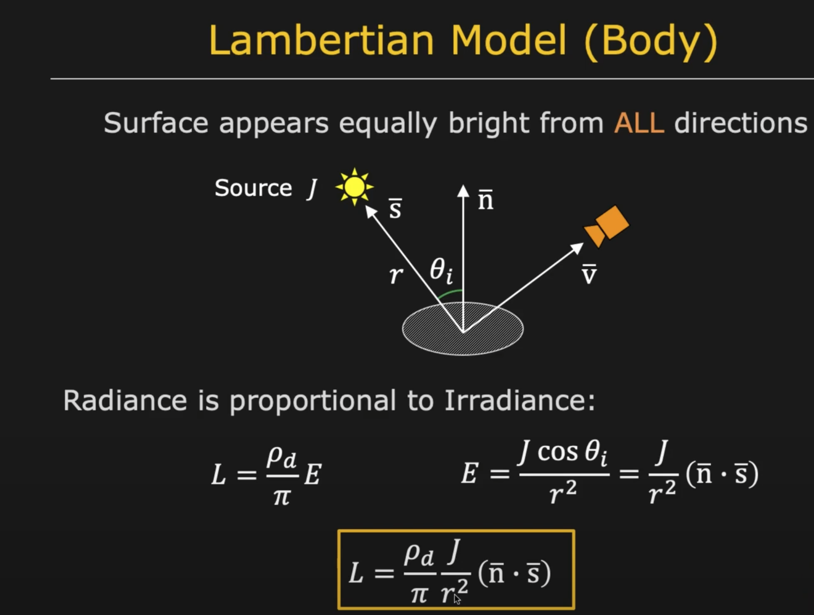
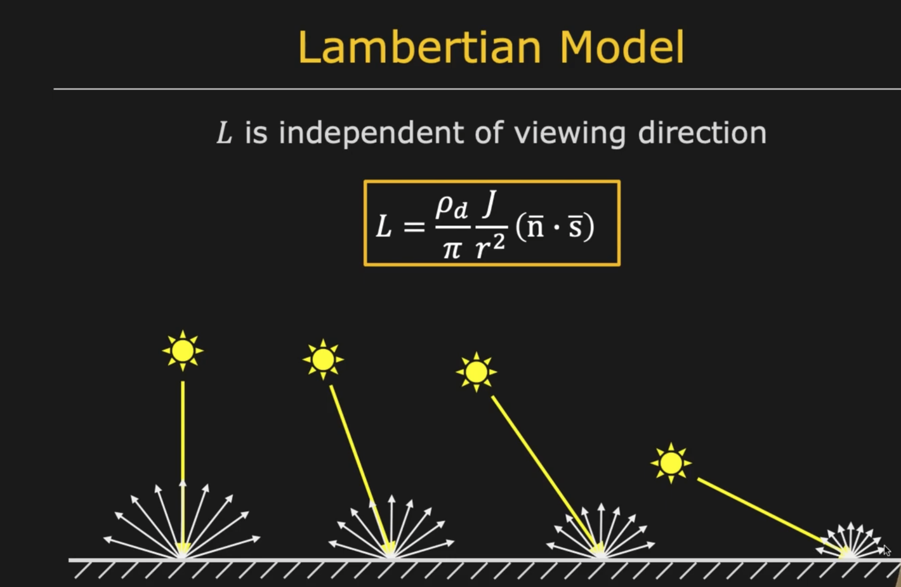
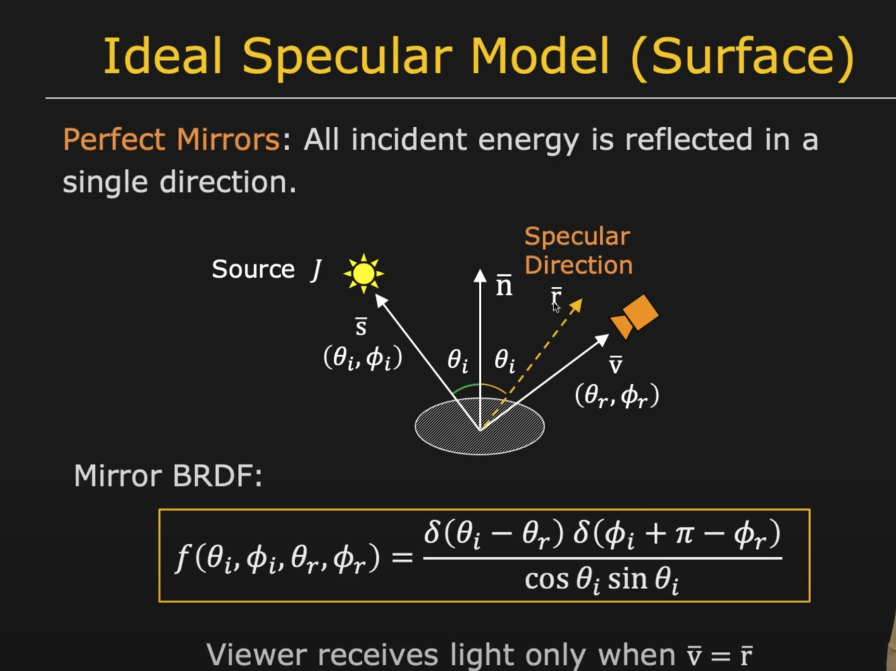
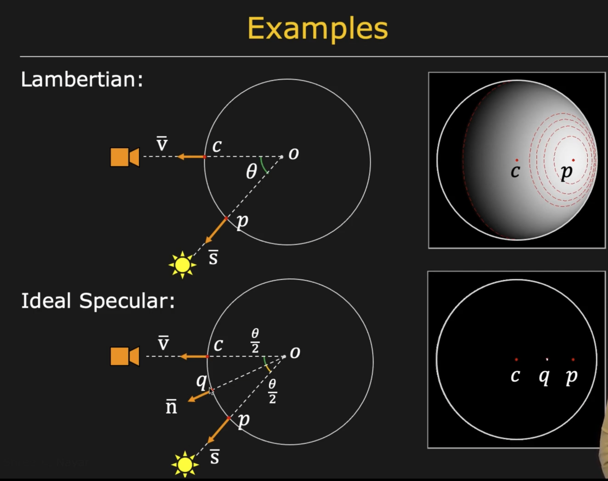
## Photometric Stereo
