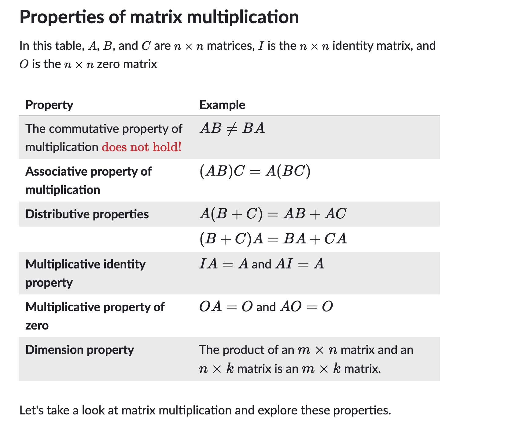
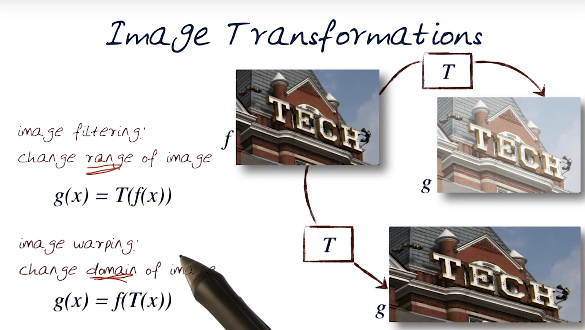
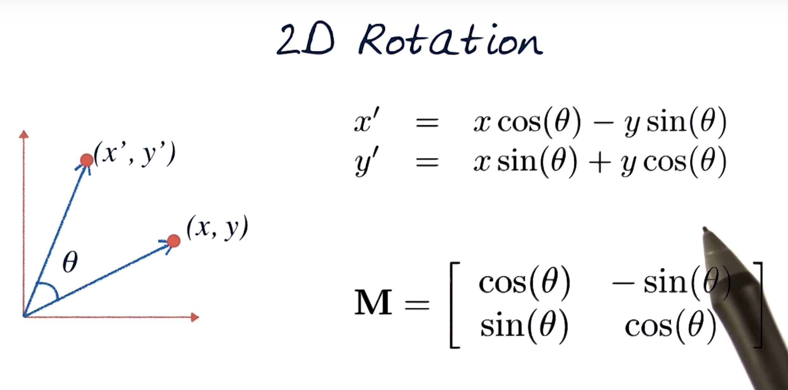
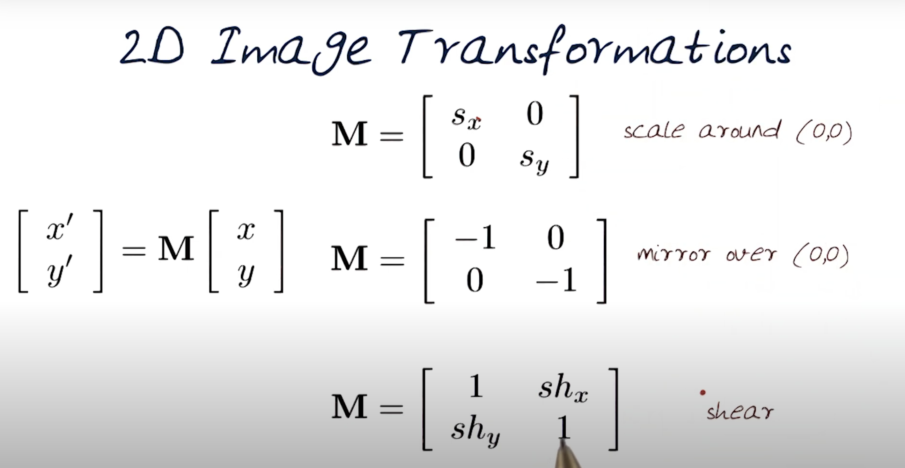
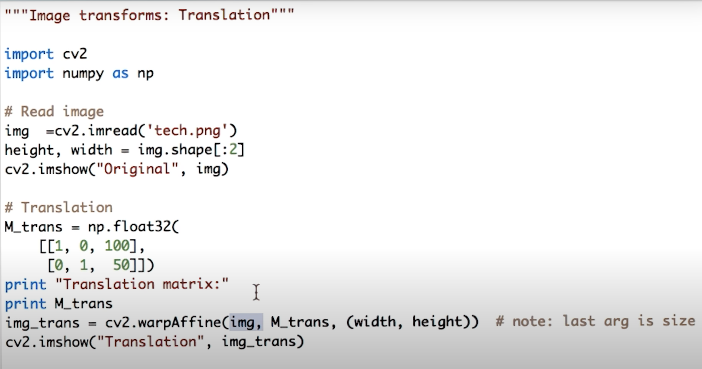
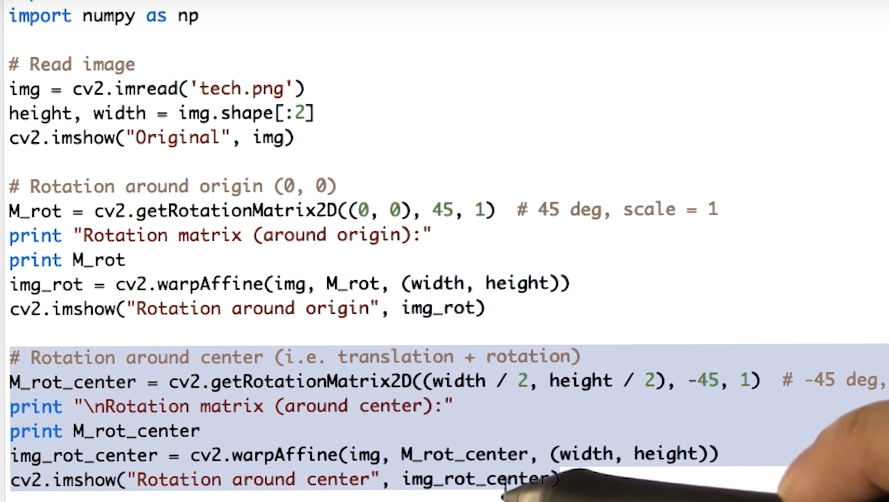

## Transformation overview

 If only the inputs are transformed, then only the domain will change. If only
the outputs are transformed, then only the range will change - [source](https://web.ics.purdue.edu/~pdevlin/Traditional%20Class/Lesson%2022/Domain%20and%20Range%20of%20a%20Transformation.pdf)

https://www.youtube.com/watch?v=O508zuEgeSo

## WHy homogenous coordinates from translation point of view
https://www.youtube.com/watch?v=cTlsAP93oz4
[homogenous coordinates](https://www.youtube.com/watch?v=JSLG8n_IY9s)

## Transformations
https://www.youtube.com/watch?v=StO2I08uaFk

https://www.youtube.com/watch?v=n4I7pUxhuqI

[OpenCV Tranlation Example](https://www.youtube.com/watch?v=n23GYiaP3kU)

[OpenCV Rotation Example](https://www.youtube.com/watch?v=6xq3Rh5Q_jU)

