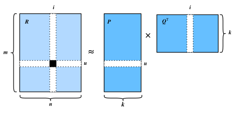
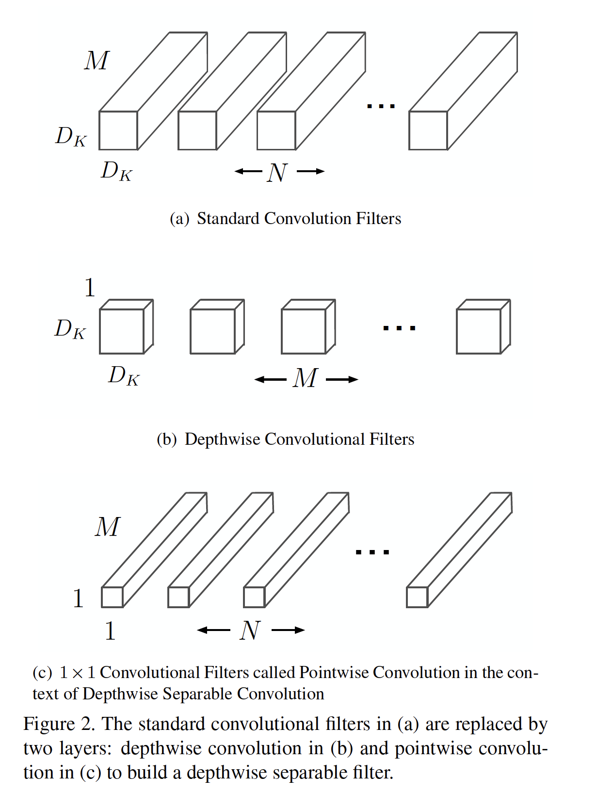

# Matrix factorization  
## Recommender System - Collaborative Filters
https://d2l.ai/chapter_recommender-systems/mf.html

managing a 2D multipled matrix explode the number of variables. But instead managing a sub dimension of them and then rely on matrix multiplication, you reduce the number of variables to a summation of two smaller matrix.

## factorized convolutions
Traditional convolution is using a 4D matrix as filter.
It can be factorized into two directions: depth and spacial.
Google MobileNet Architecture uses a depthwise separable convolution: a for of factorized convolutions
which factorize a standard convolution into a **depthwise**
convolution and a 1x1 convolution called a **pointwise** convolution. The depthwise separable convolution splits into two layers, a separate layer for filtering and a separate layer for combining.
- depthwise convolution: applies a single filter to each input channel
- pointwise convolution: then applies a 1x1 convolution to combine the outputs from depthwise convolution.

# Calibration

# Sampling

# Pooling

# Overfitting: Regularization & Dropout
