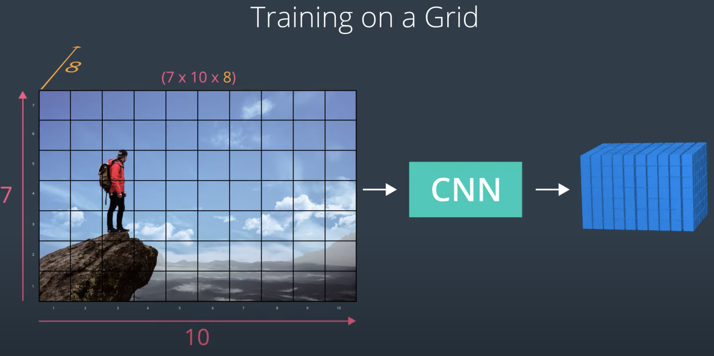

# problems
robustness & Accuracy
1. responsivenss : is it similar to web responsiveness by measuring unresponsive time
2. precise (low-jittter)
3. low-compute budget
4. latency reduced
4. acquiring sufficient high-quality ground truth data.  Hand keypoints are impractical to **manually annotate** in images
due to frequent **self-occlusions**. Several existing methods use a
multi-view capture system to alleviate these challenges, but these
systems are not easily portable, which limits the ability to capture
a diverse set of background and lighting environments. As
a workaround, [Zimmermann et al. 2019] uses a green screen for
background replacement as a post-processing, but cannot support
**variation in lighting**

# solutions
- outside-indepth: provides hand geometry in terms of a 2.5D point cloud.
    - cons: extra hardware requirment and power usage
-  or RGB cameras: Early RGB-based methods [de La Gorce
et al. 2008; Prisacariu and Reid 2011; Stenger et al. 2006] follow
an analysis-by-synthesis paradigm, fitting a hand model to low
level visual cues such as edges, skin color, silhouettes and optical
    -pros: easier to integrate, improve with deep learning advancement
    - cons:
        1. scale ambiguities, making it not directly suitable for the 3D pose estimation needed to drive VR input. While scale ambiguity can be resolved with stereo, existing methods cannot be easily adapted to achieve consistent predictions in multi-view settings.
        2. most RGB-based methods either focus on **keypoint regression** [Cai et al. 2018; Iqbal et al. 2018; Spurr et al. 2018; Yang and Yao 2019; Zhang et al. 2016; Zimmermann and Brox 2017a] or **simultaneous pose and shape reconstruction** [Boukhayma et al. 2019; Ge et al. 2019; Hasson et al. 2019; Zhang et al. 2019b], neither of which are well-suited to maintain self-presence requirements inside VR/AR applications.The former cannot be directly used to render an actual hand mesh or re-target hand motion. The latter does not guarantee consistency of the hand shape over time.
        3. prior work on RGB-based tracking does not use or evaluate against **temporal information**, leading to jittery predictions unsuitable for targeting tasks.
- recent: The current state-of-the-art is dominated by deep learning based
approaches, which directly regress coordinates of hand skeleton
keypoints [Cai et al. 2018; Iqbal et al. 2018; Spurr et al. 2018; Tekin
et al. 2019; Yang and Yao 2019; Zhang et al. 2016; Zimmermann
and Brox 2017a] and can be highly accurate when fed sufficient
training data. Recent work [Cai et al. 2018; Iqbal et al. 2018; Spurr
et al. 2018; Tekin et al. 2019; Yang and Yao 2019] has focused on
frame-wise estimation. Because motion cues are largely ignored,
the result can be jittery, especially when fingers are occluded. One
notable exception [Cai et al. 2019] leverages temporal information
with graph convolution but ignores hand shape consistency. Most
recently, [Boukhayma et al. 2019; Ge et al. 2019; Hasson et al. 2019;
Zhang et al. 2019b] extend deep neural networks to directly recover
both hand shape and pose. However, no personalization process is
involved and there is no guarantee that the hand shape of the same
user will not change across frames

## Key technologies
### 1. keypoint regression network
### 2. depth-based hand-tracking
[Articulated Distance Fields for Ultra-Fast Tracking of Hands Interacting](https://dl.acm.org/doi/pdf/10.1145/3130800.3130853) to generate accurate
ground truth for training our neural networks, leveraging the
benefits of both systems.
## Data Solutions
workaround to generating real-world training data is to synthesize images [Mueller et al. 2018]. However, it’s still
unclear how to generate synthetic data that is **realistic enough** to
train networks that **generalize across users and environments**
- [Depth-based hand pose estimation: data, methods, and challenges](https://openaccess.thecvf.com/content_iccv_2015/papers/Supancic_Depth-Based_Hand_Pose_ICCV_2015_paper.pdf)
- GANerated Hands for Real-Time 3D Hand Tracking from Monocular RGB
- Learning from Simulated and Unsupervised Images through

initialize the pose estimation
network with synthesized data. The network is then fine-tuned on
unlabeled real data by minimizing the model fitting error
- How to Refine 3D Hand Pose Estimation from Unlabelled Depth Data Adversarial Training
- Self-supervised 3D hand pose estimation through training by fitting.

we use a depth tracker to generate ground truth hand
poses for training the keypoint estimation network. This modelbased
tracker requires minimal human intervention (2D bounding
boxes) if the tracker fails. Our system maximizes the quality of
the ground truth data without sacrificing mobility. As a result, our
training set is larger and more diverse in terms of hand shape,
pose and background variation

## Motion Tracking
### optical flow
assumptions is between two consecutive frames
    1. pixel intensities stay consistent between frames
    2. neighboring pixels have similar motion


Optical Flow is a well-researched and fast algorithm and it is used in a lot of tracking technology, today! One such example is the [NVIDIA Redtail drone](https://blogs.nvidia.com/blog/2017/06/09/drone-navigates-without-gps/), which uses optical flow to track surrounding objects in a video stream.

### Classfication & localization.
Localization is all about finding out exactly where an object is in an environment and then tracking it over time as it moves (and in the case of a robot) as it gathers sensor measurements via camera, radar, LiDAR, or other sensors.


loss functions:
- L1 loss

Look at the documentation for Smooth L1 Loss. For a ground truth coordinate (2, 5) and a predicted coordinate (2.5, 3), what is the smooth L1 loss between these points?
```
For a difference less than 1, in the case between 2.5 and 2, we use a squared function 0.5*(0.5)^2 = 0.125 and for a difference greater than one as is the case between 3 and 5, we use a linear function 2-0.5 = 1.5. We then sum the losses between these two points and take their average: (1/2)*(0.125+1.5) = 0.8125.
```

- [MSE loss](https://pytorch.org/docs/stable/nn.html#mseloss): amplify outliers
Look at the documentation for MSE Loss. For a ground truth coordinate (2, 5) and a predicted coordinate (2.5, 3), what is the MSE loss between these points? (You may assume default values for averaging.)
```
MSE loss is calculated by 1. summing the squared differences between points: (2.5-2)^2 + (3-5)^2 = 4.25 and then 2. averaging that sum, so for two values this is 4.25/2 = 2.125.
```

- [smooth L1 loss](https://pytorch.org/docs/stable/generated/torch.nn.SmoothL1Loss.html#torch.nn.SmoothL1Loss): combine both

- Weighted Loss Functions
You may be wondering: how can we train a network with two different outputs (a class and a bounding box) and different losses for those outputs?

We know that, in this case, we use categorical cross entropy to calculate the loss for our predicted and true classes, and we use a regression loss (something like smooth L1 loss) to compare predicted and true bounding boxes. But, we have to train our whole network using one loss, so how can we combine these?

There are a couple of ways to train on multiple loss functions, and in practice, we often use a weighted sum of classification and regression losses (ex. 0.5*cross_entropy_loss + 0.5*L1_loss); the result is a single error value with which we can do backpropagation. This does introduce a hyperparameter: the loss weights. We want to weight each loss so that these losses are balanced and combined effectively, and in research we see that another regularization term is often introduced to help decide on the weight values that best combine these losses.

## How to select multiple regions for objects in a single image?
CNN has a fixed output, what if a image has multiple objects then?

https://www.youtube.com/watch?v=HLwpr7h3rPY

### R-CNN (Region Proposal Network)
https://www.youtube.com/watch?v=EchapZJMTYU

faster R-CNN: https://www.youtube.com/watch?v=6FOBZ9OgWlY

RoI Pooling


To warp regions of interest into a consistent size for further analysis, some networks use RoI pooling. RoI pooling is an additional layer in our network that takes in a rectangular region of any size, performs a maxpooling operation on that region in pieces such that the output is a fixed shape. Below is an example of a region with some pixel values being broken up into pieces which pooling will be applied to; a section with the values:
```
[[0.85, 0.34, 0.76],
 [0.32, 0.74, 0.21]]
```
Will become a single max value after pooling: 0.85. After applying this to an image in these pieces, you can see how any rectangular region can be forced into a smaller, square representation.

Speed
Fast R-CNN is about 10 times as fast to train as an R-CNN because it only creates convolutional layers once for a given image and then performs further analysis on the layer. Fast R-CNN also takes a shorter time to test on a new image! It’s test time is dominated by the time it takes to create region proposals.

Fastest R-CNN:https://www.youtube.com/watch?v=ySh_Q3KTTBY
- [Deep Learning for Object Detection: A Comprehensive Review](https://towardsdatascience.com/deep-learning-for-object-detection-a-comprehensive-review-73930816d8d9)
- [faster-rcnn.pytorch](https://github.com/jwyang/faster-rcnn.pytorch)

Region Proposal Network
You may be wondering: how exactly are the RoI's generated in the region proposal portion of the Faster R-CNN architecture?

The region proposal network (RPN) works in Faster R-CNN in a way that is similar to YOLO object detection, which you'll learn about in the next lesson. The RPN looks at the output of the last convolutional layer, a produced feature map, and takes a sliding window approach to possible-object detection. It slides a small (typically 3x3) window over the feature map, then for each window the RPN:

Uses a set of defined anchor boxes, which are boxes of a defined aspect ratio (wide and short or tall and thin, for example) to generate multiple possible RoI's, each of these is considered a region proposal.
For each proposal, this network produces a probability, Pc, that classifies the region as an object (or not) and a set of bounding box coordinates for that object.
Regions with too low a probability of being an object, say Pc < 0.5, are discarded.
Training the Region Proposal Network
Since, in this case, there are no ground truth regions, how do you train the region proposal network?

The idea is, for any region, you can check to see if it overlaps with any of the ground truth objects. That is, for a region, if we classify that region as an object or not-object, which class will it fall into? For a region proposal that does cover some portion of an object, we should say that there is a high probability that this region has an object init and that region should be kept; if the likelihood of an object being in a region is too low, that region should be discarded.


Speed Bottleneck <br>
Now, for all of these networks including Faster R-CNN, we've aimed to improve the speed of our object detection models by reducing the time it takes to generate and decide on region proposals. You might be wondering: is there a way to get rid of this proposal step entirely? And in the next section we'll see a method that does not rely on region proposals to work!
## CNN & Sliding Window
sliding windows [video](https://www.youtube.com/watch?v=8qYqqibIz90) <br>
Let’s now select a window size of 10 x 10 pixels as shown below:
If we use a stride of 2 pixels, it will take 16 windows to cover the entire image, as we can see below.


What will happen if we change the input of the above CNN from 10 x 10 x 3, to 16 x 16 x 3? The result is shown below:sli


If we follow the region of the image that corresponds to the first window through this new CNN, we see that the result is the upper-left corner of the last layer (see image above). Similarly, if we follow the section of the image that corresponds to the second window through this new CNN, we see the corresponding result in the last layer:


In fact, if we follow all the windows through the CNN we see that all the 16 windows are contained within the last layer of this new CNN. Therefore, passing the 16 windows individually through the old CNN is exactly the same as passing the whole image only once through this new CNN.

This is how you can apply sliding windows with a CNN. This technique makes the whole process much more efficient. However, this technique has a downside: the position of the bounding boxes is not going to be very accurate. The reason is that it is quite unlikely that a given size window and stride will be able to match the objects in the images perfectly. In order to increase the accuracy of the bounding boxes, YOLO uses a grid instead of sliding windows, in addition to two other techniques, known as Intersection Over Union and Non-Maximal Suppression. The combination of the above techniques is part of the reason the YOLO algorithm works so well. Before diving into how YOLO puts all these techniques together, we will look first at each technique individually.

## YOLO - [You Only Look Once: Unified, Real-Time Object Detection](https://arxiv.org/abs/1506.02640)
8 dimension vectors as a prediction for a grid cell

for e2e training, train a cnn output number of cells in each dimension, and 8 dimensions as depth. In the example, output CNN dimension is 7x10x8

How does YOLO find a correct bounding box when it looks at an image broken up by grid? Training data assigns the ground truth bounding box of one object to only one grid cell in the training image. For othe grid cells also containing the object, we label them as if they do not contain the object. Here is the process:
1. for each trianing image, locate the mid-point of each object in the image
2. assign the true bounding box to grid cell that contains the mid-point

To calculate x,y,w,h:
- x,y are relative and normalized to the current grid cell
- w,h are relative and normalized to the entire image


- [using a grid](https://www.youtube.com/watch?v=OmgR35Go79Y)
- [training E2E on a Grid](https://www.youtube.com/watch?v=uhefpakvXh8)
- [generating bounding boxes](https://www.youtube.com/watch?v=TGfPX-XcyOs)
-[too many boxes](https://www.youtube.com/watch?v=nYDWsFdFnQ8)
- [anchor boxes](https://www.youtube.com/watch?v=IzILYgVb76g)

### Intersection over Union (IoU)
given by the area of: intersection/union

- Imagine you’re comparing a ground truth box to a predicted box. If you want your predicted box to be as close to this ground truth box as possible, you want IoU to be 1. The IoU between two bounding boxes will always have a value between 0 and 1 because

## ResNet
https://d2l.ai/chapter_convolutional-modern/resnet.html

## SSD

## Smaller Networks


## FOV

## 1x1 conv layer
https://machinelearningmastery.com/introduction-to-1x1-convolutions-to-reduce-the-complexity-of-convolutional-neural-networks/

Pooling layers are designed to downscale feature maps and systematically halve the width and height of feature maps in the network. Nevertheless, pooling layers do not change the number of filters in the model, the depth, or number of channels.

Deep convolutional neural networks require a corresponding pooling type of layer that can downsample or reduce the depth or number of feature maps.
The solution is to use a 1×1 filter to down sample the depth or number of feature maps.This structure allows the 1×1 filter to act like a single neuron with an input from the same position across each of the feature maps in the input. This single neuron can then be applied systematically with a stride of one, left-to-right and top-to-bottom without any need for padding, resulting in a feature map with the same width and height as the input. This simple 1×1 filter provides a way to usefully summarize the input feature maps. The use of multiple 1×1 filters, in turn, allows the tuning of the number of summaries of the input feature maps to create, effectively allowing the depth of the feature maps to be increased or decreased as needed. A convolutional layer with a 1×1 filter can, therefore, be used at any point in a convolutional neural network to control the number of feature maps. As such, it is often referred to as a projection operation or projection layer, or even a feature map or channel pooling layer.


The cross channel parametric pooling layers is equivalent to a conv layer with 1x1 convolution kernel.


It is equivalent to having a dense layer on all parts of input

## [Global Average Pooling](https://paperswithcode.com/method/global-average-pooling)
Introduced by Lin et al. in Network In Network

 Edit
Global Average Pooling is a pooling operation designed to replace fully connected layers in classical CNNs. The idea is to generate one feature map for each corresponding category of the classification task in the last mlpconv layer. Instead of adding fully connected layers on top of the feature maps, we take the average of each feature map, and the resulting vector is fed directly into the softmax layer.

One advantage of global average pooling over the fully connected layers is that it is more native to the convolution structure by enforcing correspondences between feature maps and categories. Thus the feature maps can be easily interpreted as categories confidence maps. Another advantage is that there is no parameter to optimize in the global average pooling thus overfitting is avoided at this layer. Furthermore, global average pooling sums out the spatial information, thus it is more robust to spatial translations of the input.
## keypoint detection
[Y. Wang and Y. Song, "Facial Keypoints Detection," Stanford University,
2014]()

[S. Longpre and A. Sohmshetty, "Facial Keypoint Detection," Stanford
University, 2016.]()

[Facial Key Points Detection using Deep
Convolutional Neural Network - NaimishNet](https://arxiv.org/pdf/1710.00977.pdf)

# Implementation: MegaTrack 2020
## 1. Hand Detection
find the bounding box of each hand in everty input image.
- data: robustness to a variety of real world environments: collect a large and varied hand detection data specific to a camera configuration using semi-automatic labeling method
- CNN arch named DetNet: inspired by lightweight single shot detectors(SSD), which simultaneously localize
and classify. we design
DetNet to directly regress the **2D hand center** and **scalar radius**
for each hand from the VGA-resolution input image. In addition **a scalar “confidence” output indicates whether the given hand is
present in the image** <br>
        - [Ssd: Single shot multibox detector](https://arxiv.org/abs/1512.02325) <br>
        - [YOLO9000: Better, Faster, Stronger](https://arxiv.org/abs/1612.08242)

IRB: Inverted residual building block
- 2018 [ChamNet: Towards Efficient Network Design Through Platform-
Aware Model Adaptation.]()
- 2019 [MobileNetV2: Inverted Residuals and Linear Bottlenecks](https://arxiv.org/pdf/1801.04381.pdf)

Resnet34
- [Deep residual learning
for image recognition]()
### [Network in network]https://arxiv.org/pdf/1312.4400.pdf)
1x1 conv:
### SSD
The fundamental improvement in
speed comes from eliminating bounding box proposals and the subsequent pixel or feature
resampling stage. Our improvements include using a small convolutional filter to predict object
categories and offsets in bounding box locations, using separate predictors (filters) for
different aspect ratio detections, and applying these filters to multiple feature maps from
the later stages of a network in order to perform detection at multiple scales

- instead of thinking of an entire CNN as the feature extractor, we can think of each subpart of the CNN as a feature extractor. The idea is attach mini-neural networks to intermediate layers of a pre-trained network.
- a set of default boxes of different shape(aspect ration & size) are applied at every scale. The dog because it is large is found in larger sclae, cat found in smaller scale


## Measurement
- frame per second (FPS)
## Data Augmentation
ata even further, the training loop of AlexNet added a great deal of image augmentation, such as flipping, clipping, and color changes. This makes the model more robust and the larger sample size effectively reduces overfitting

## Neural architecture search
- 2016 [Neural architecture search with reinforcement learning](https://arxiv.org/abs/1611.01578)
- 2018 [Mnasnet: Platform-aware neural architecture search for mobile](): allowing different layers to choose different
blocks leads to better accuracy and efficiency.

## MobileNet1&2
https://medium.com/@luis_gonzales/a-look-at-mobilenetv2-inverted-residuals-and-linear-bottlenecks-d49f85c12423

The perhaps-more-functionally-correct interpretation of 2D convolution is portrayed in Fig. 2. A filter (shown in orange) is stepped along the spatial dimensions of an input volume (shown in blue). An inner product is taken between the overlapping regions of the input volume and filter at every step (shown in light red). In practice, the overlapping portion of both the filter and input volume are vectorized and the dot product is taken between the two resulting vectors. In either case, a single value is computed, as shown by the red element in Fig. 2. Although functionally-correct, this interpretation obscures the spatial filtering that occurs within the convolution


The other interpretation of the standard 2D convolution draws more emphasis to the spatial filtering that takes place. Similar to the interpretation above, a filter, shown in Fig. 3(b), is stepped along the spatial dimensions of an input volume, shown in Fig. 3(a). But rather than the inner product spanning the depth dimension, the inner product is taken on a per-channel basis. In other words, channel i in the input volume is convolved with channel i in the filter (single channel convolution), where i indexes along the depth dimension. The resulting volume is shown in Fig. 3(c). Finally, all resulting values are summed, leading to a single value, which is not shown. Again, note that this interpretation emphasizes the spatial filtering and that for N filters, each and every channel of the input volume is filtered N times, which begins to seem rather excessive.


- Depth-wise Separable Convolutions


Depth-wise separable convolutions were introduced in MobileNetV1 and are a type of factorized convolution that reduce the computational cost as compared to standard convolutions. The new MobileNetV2 layer incorporates depth-wise separable convolutions, so it’s worthwhile reviewing them.
Despite the standard convolution contains spatial filtering and linear combinations, note that it’s not possible to decompose or factorize the two stages. Constrastingly, the depth-wise separable convolution is structured around such factorization. As before, suppose an input volume of Dᵤ x Dᵤ x M is transformed to an output volume of Dᵥ x Dᵥ x N, as shown in Fig. 4(a). The first set of filters, shown in Fig. 4(b), are comprised of M single-channel filters, mapping the input volume to Dᵥ x Dᵥ x M on a per-channel basis. This stage, known as depth-wise convolutions, resembles the intermediate tensor shown in Fig. 3(c) and achieves the spatial filtering component. In order to construct new features from those already captured by the input volume, we require a linear combination. To do so, 1x1 kernels are used along the depth of the intermediate tensor; this step is referred to as point-wise convolution. N such 1x1 filters are used, resulting in the desired output volume of Dᵥ x Dᵥ x N.
The lowered computational cost of depth-wise separable convolutions comes predominantly from limiting the spatial filtering from M*N times in standard convolutions to M times.

- Inverted Residual and Linear Bottleneck Layer
    - point wise: 1x1xn, change channel depth
    - depth-wise: 3x3, spatial filter per channel, do not change channel depth


# Open Questions
1. how to leverage time sequence in a video to make object detection efficient
    - what are some assumptions to leverage

# Faster single object detection
- simplified YOLO
- or treat it as classificaiton problem
- factorizing
- Compression based on
    - product quantization: [Quantized
convolutional neural networks for mobile devices.](https://arxiv.org/abs/1512.06473)
    - hashing: [Compressing neural networks with the hashing
trick](https://arxiv.org/abs/1504.04788)
    - [pruning, trained quantization and huffman coding](https://arxiv.org/abs/1510.00149)
- Another method for training
small networks is distillation: [Distilling the Knowledge in a Neural Network
](https://arxiv.org/abs/1503.02531)
- network pruning
- hyperparameter optimization
- genetic algorithm
- RL to architectural search
- connectivity learning
- compressing pretrained networks
- training small networks directly
- A common practice to reduce the FLOP count of a network is to shrink
the input resolution. A smaller input resolution may require
a smaller receptive field of the network and therefore shallower
layers.

papers:
- 2016 [Design of efficient convolutional layers using single
intra-channel convolution, topological subdivisioning
and spatial ”bottleneck” structure](https://arxiv.org/abs/1608.04337)
- 2016 [Neural architecture
search with reinforcement learning.](https://arxiv.org/abs/1611.01578)
- 2017 [Learning transferable architectures
for scalable image recognition](https://arxiv.org/abs/1707.07012)
- 2017 [Shufflenet: An extremely efficient
convolutional neural network for mobile devices.](https://arxiv.org/abs/1707.01083)
- 2017 [Mobilenets: Efficient convolutional neural networks
for mobile vision applications](https://arxiv.org/pdf/1704.04861.pdf)
- 2018 [MobileNetV2: Inverted Residuals and Linear Bottlenecks](https://arxiv.org/abs/1801.04381)
- 2019 [MnasNet: Platform-Aware Neural Architecture Search for Mobile](https://arxiv.org/pdf/1807.11626.pdf)
- 2019 [FBNet: Hardware-Aware Efficient ConvNet Design via Differentiable Neural Architecture Search](https://arxiv.org/abs/1812.03443), [github](https://github.com/facebookresearch/mobile-vision): construct a layer-wise search space with
a fixed macro-architecture, and each layer can choose a different
block. Instead of solving for the optimal architecture a 2 A,
which has a discrete search space, we relax the problem to
optimize the probability P  of the stochastic super net to achieve the minimum expected loss
- 2020 [EfficientNet: Rethinking Model Scaling for Convolutional Neural Networks](https://arxiv.org/abs/1905.11946)
- 2021 [FBNetV3: Joint Architecture-Recipe Search using Neural Acquisition Function](https://arxiv.org/pdf/2006.02049.pdf)
- 2022 [FBNetV5 Part II: Efficient Multi-task Modeling](https://fb.workplace.com/groups/1657374881196345/permalink/3015431022057384/)


## Validation
(How do papers validate their results?)

## Metrics
Accuracy vs latency: Unlike previous work, where latency is considered
via another, often inaccurate proxy (e.g., FLOPS), our
approach directly measures real-world inference latency
by executing the model on mobile phones. Our idea is inspired by the observation
that FLOPS is often an inaccurate proxy: for example,
MobileNet [11] and NASNet [36] have similar FLOPS
(575M vs. 564M), but their latencies are significantly different
(113ms vs. 183ms,

## Core Techniques
- depthwise convolutio: mobilenet
- group convolution: shufflenet
## Empirical Learnings

- Previous works [30, 31, 16, 11, 12] focus on cell level
architecture search. Once a cell structure is searched, it
is used in all the layers across the network. However,
many searched cell structures are very complicated and
fragmented and are therefore slow when deployed to mobile
CPUs [17, 13]. Besides, at different layers, the same
cell structure can have a different impact on the accuracy
and latency of the overall network. As shown in [20] and in
our experiments, allowing different layers to choose different
blocks leads to better accuracy and efficiency.
- We use relatively small channel sizes for early layers,
since the input resolution at early layers is large, and the
computational cost (FLOP count) is quadratic to input size.
- A common technique to reduce the computational cost of a ConvNet is to reduce the input resolution or channel size without changing the ConvNet structure. This approach is
likely to be sub-optimal. We hypothesize that with a different
input resolution and channel size scaling, the optimal
ConvNet structure will be different

- MobileNetV1： With the exception of the first layer, we use constant
expansion rate throughout the network. In our experiments
we find that expansion rates between 5 and 10 result
in nearly identical performance curves, with smaller
networks being better off with slightly smaller expansion
rates and larger networks having slightly better performance
with larger expansion rates.
- FBnet: We visualize the architecture of FBNet-96-0.35-1 in Figure
4, we can see that many layers are skipped, and the network
is much shallower than FBNet-fA, B, Cg, whose input size is 224. We conjecture that this is because with smaller input size, the receptive field needed to parse the image also
becomes smaller, so having more layers will not effectively
increase the accuracy.

## NAS
Although these methods can generate mobile-size models
by repeatedly stacking a few searched cells, they do not incorporate
mobile platform constraints into the search process
or search space.
### RL
- B. Baker, O. Gupta, N. Naik, and R. Raskar. Designing
neural network architectures using reinforcement learning.
ICLR, 2017.
- C. Liu, B. Zoph, J. Shlens, W. Hua, L.-J. Li, L. Fei-Fei,
A. Yuille, J. Huang, and K. Murphy. Progressive neural architecture
search. ECCV, 2018.
- H. Pham, M. Y. Guan, B. Zoph, Q. V. Le, and J. Dean.
Efficient neural architecture search via parameter sharing.
ICML, 2018.
- B. Zoph and Q. V. Le. Neural architecture search with reinforcement
learning. ICLR, 2017.
- B. Zoph, V. Vasudevan, J. Shlens, and Q. V. Le. Learning
transferable architectures for scalable image recognition.
CVPR, 2018.
### evolutionary search
- E. Real, A. Aggarwal, Y. Huang, and Q. V. Le. Regularized
evolution for image classifier architecture search. AAAI, 2019.
### differentiable search
H. Liu, K. Simonyan, and Y. Yang. DARTS: Differentiable
architecture search. ICLR, 2019.
### other learning algorithms
- C. Liu, B. Zoph, J. Shlens, W. Hua, L.-J. Li, L. Fei-Fei,
A. Yuille, J. Huang, and K. Murphy. Progressive neural architecture
search. ECCV, 2018.
- K. Kandasamy,W. Neiswanger, J. Schneider, B. Poczos, and
E. Xing. Neural architecture search with bayesian optimisation
and optimal transport. NeurIPS, 2018.
- R. Luo, F. Tian, T. Qin, and T.-Y. Liu. Neural architecture
optimization. NeurIPS, 2018.
### Multi-Objective

attempt to optimize multiple objectives, such as model size
and accuracy, while searching for CNNs, but their search
process optimizes on small tasks like CIFAR

- C.-H. Hsu, S.-H. Chang, D.-C. Juan, J.-Y. Pan, Y.-T. Chen,
W. Wei, and S.-C. Chang. MONAS: Multi-objective neural
architecture search using reinforcement learning. arXiv
preprint arXiv:1806.10332, 2018.
- J.-D. Dong, A.-C. Cheng, D.-C. Juan, W. Wei, and M. Sun.
DPP-Net: Device-aware progressive search for paretooptimal
neural architectures. ECCV, 2018.
- T. Elsken, J. H. Metzen, and F. Hutter. Multi-objective architecture
search for cnns. arXiv preprint arXiv:1804.09081, 2018.

this paper targets real-world mobile latency constraints and
focuses on larger tasks like ImageNet classification and
COCO object detection.
- MnasNet
