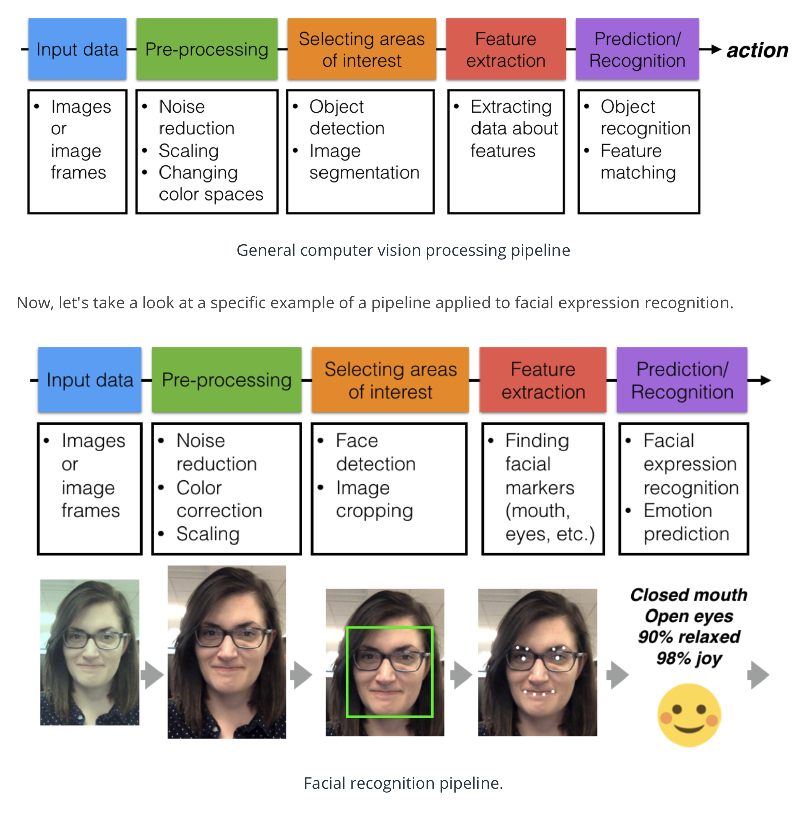
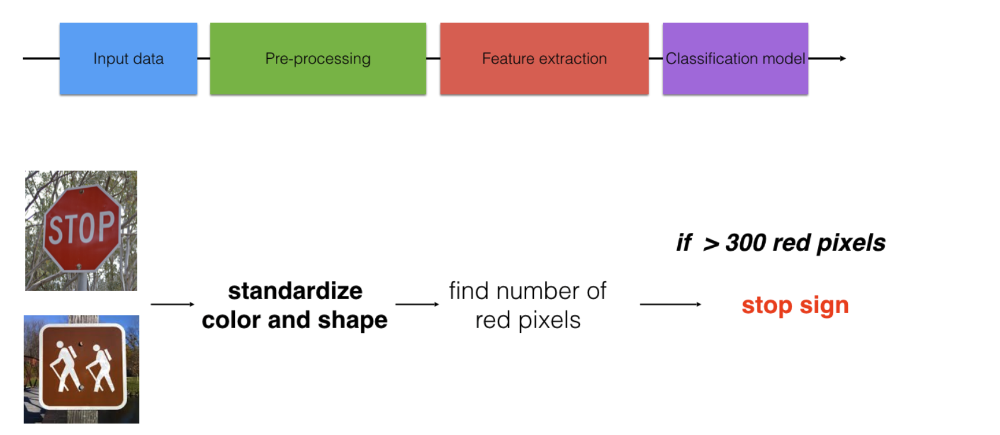

## Computer Vision Pipeline
A computer vision pipeline is a series of steps that most computer vision applications will go through. Many vision applications start off by acquiring images and data, then processing that data, performing some analysis and recognition steps, then finally performing an action. The general pipeline is pictured below!

### Standardizing Data
Pre-processing images is all about standardizing input images so that you can move further along the pipeline and analyze images in the same way. In machine learning tasks, the pre-processing step is often one of the most important.

For example, imagine that you've created a simple algorithm to distinguish between stop signs and other traffic lights.

Images of traffic signs; a stop sign is on top and a hiking sign is on the bottom.

If the images are different sizes, or even cropped differently, then this counting tactic will likely fail! So, it's important to pre-process these images so that they are standardized before they move along the pipeline. In the example below, you can see that the images are pre-processed into a standard square size.

The algorithm counts up the number of red pixels in a given image and if there are enough of them, it classifies an image as a stop sign. In this example, we are just extracting a color feature and skipping over selecting an area of interest (we are looking at the whole image). In practice, you'll often see a classification pipeline that looks like this.

## Why BGR instead of RGB?
OpenCV reads in images in BGR format (instead of RGB) because when OpenCV was first being developed, BGR color format was popular among camera manufacturers and image software providers. The red channel was considered one of the least important color channels, so was listed last, and many bitmaps use BGR format for image storage. However, now the standard has changed and most image software and cameras use RGB format, which is why, in these examples, it's good practice to initially convert BGR images to RGB before analyzing or manipulating them.

Changing Color Spaces
To change color spaces, we used OpenCV's cvtColor function, whose documentation is here.

## Color Spaces and Transform
Under different lighting, RGB value can change.

To select the most accurate color boundaries, it's often useful to use a [color picker](https://www.w3schools.com/colors/colors_picker.asp) and choose the color boundaries that define the region you want to select!

### HSV
Value (V) component varies the most under different lighting conditions;
H channel stays fairly consistent in shadow or excessive brightness. If we disregard V and use H for corlor selection, it can be reliable.

## Image Classification
Visualizing the image data you’re working with is the first step in identifying any patterns in image data and being able to make predictions about the data!
