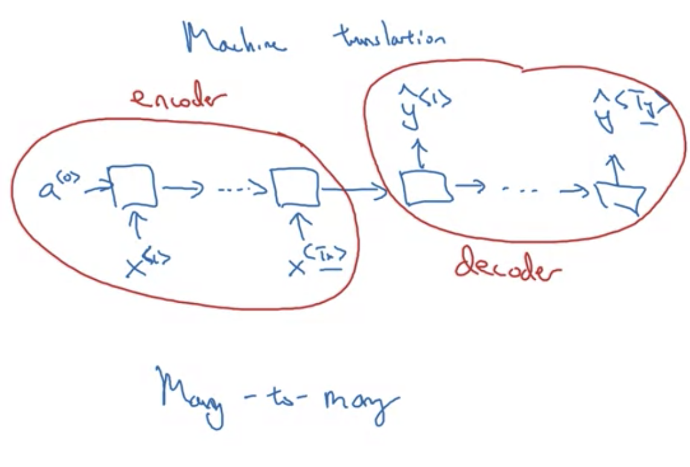
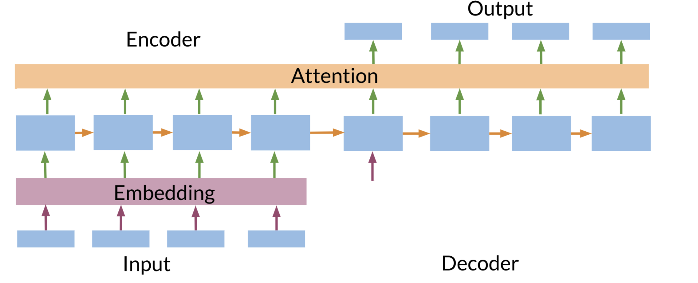

# RNN
[pythorch - RNN source code](https://pytorch.org/docs/stable/generated/torch.nn.RNN.html?highlight=rnn#torch.nn.RNN)

asume each word in the sequence is a one-hot encoding vector across the word dictionary

why not a standara network?
- inputs, outputs can be different lengths in different examples
- doesn't share features learned across different positions of text. e.g if Harry Porter is a name, no matter where it is in the position of text, it should always be learned as a name

in RNN, each input word is processed one by one

problem with RNN: it does not use informatin earlier in the sequence, not later in the sequence.

## Vanishing Gradients/ Exploding Gradient
exploding: meaning Expotential large gradients; seeing NaN/not a number. use gradient clipping to solve.
Vanishing gradient is harder to solve.
## Deep RNN (stacking)
- [l]: layer
- <t>: timestamp

## Different Types of RNN

input lenth Tx and output lenth Ty can be very different.

- sentiment clasfficiation: many to one
- music generation: one to many, e.g gener to music note sequence
- machine translation: many to many, but different length
    

## Bidirectional RNN
The disadvantage of the bidirectional RNN is that, you do need the entire sequence of data before you can make predictions anywhere. for example, if you're building a speech recognition system then BRNN will let you take into account the entire speech other friends. But if you use this straightforward implementation, you need to wait for the person to stop talking to get the entire utterance before you can actually process it, and make a speech recognition prediction

## GRU

- [On the Properties of Neural Machine Translation: Encoder-Decoder Approaches](https://arxiv.org/abs/1409.1259)
- [Empirical Evaluation of Gated Recurrent Neural Networks on Sequence Modeling](https://arxiv.org/abs/1412.3555)
elementwise multiplication between gate and cell

## Language modeling

Given a sentence, what is the probability of that sentence.
speech recognition:
  - p(The apple and paire salad) =?
  - p(The apple and pear salad) =?

### How to train language model?

## Use case
- [MULTIPLE OBJECT RECOGNITION WITH VISUAL ATTENTION](https://arxiv.org/pdf/1412.7755.pdf)
- [DRAW: A Recurrent Neural Network For Image Generation](https://arxiv.org/pdf/1502.04623.pdf)

## How
RNN output vector’s contents are influenced not only by the input you just fed in, but also on the entire history of inputs you’ve fed in in the past.

## Embedding
lower dimention representation. Very powerful because it can examine very large text corpuses, maybe found on the internet,  **unlabeled text**. It also carry out transfer learning, where you take info learned from huge amounts of unlabeled text and transfer that knowledge to a task, such as named entity rocognition, for which you have a small labeled training set.
- [Visualizing Data using t-SNE](https://www.jmlr.org/papers/volume9/vandermaaten08a/vandermaaten08a.pdf)

Steps to do transfer learning and word embeddings:
1. learn word embeddings from large text corpus (1-100B words). Or download pre-trained embedding online
2. transfer embedding to new tasks with smaller training set (say 100k words)
3. optional): contine to finetune the word embedding with new data , if yor task has pretty big data set

Note word embeddings tend to make the biggest difference when the task has relatively small train set. It has been less useful for language modeling, machine translation, especially if you are accessing a task with a lot of data dedicated to the task.

Similarly in CNN, we train network and ghet low-dimention representaion for different faces (e.g 128 dimensions). You can compare these encodings in order to figure out if these two pictures are of the same face.

[Linguistic Regularities in Continuous Space Word Representations](https://www.microsoft.com/en-us/research/wp-content/uploads/2016/02/rvecs.pdf)

### Analogies using word embedding

to solve this e_man - e_womain = e_king - e_? => find word wi where argmax sim(e2, e_king-e_man+e_woman)

most common used similarity is cosine similartiy. The nominator is basically dot product;
you can also use square distance (u-v)^2

### Embedding Matrix(table)
When you implement an algorithm to learn a word embedding, what you end up learning is an embedding matrix.
    

### Learning Word Embeddings

**1. N Gram** 
(N-gram) Large language models in machine translation 

**2. Nueral network based language models**  
[A Neural Probabilistic Language Model](https://www.jmlr.org/papers/volume3/bengio03a/bengio03a.pdf). (**This paper is most well written to understand everything**)

posing of machine lenaring problem to learn embedding: input the context like the last 4 words and predict some target word

The embedding matrix can be thought of either a look up table or a matrix of weight to be tuned. For a trining example, with one-hot encoding as a known input, multiple by weights (embedding matrix):
parameters of the mapping C are simply the feature vectors themselves, represented by a jVj m
matrix C whose row i is the feature vector C(i) for word i. The function g may be implemented by a
feed-forward or recurrent neural network or another parametrized function, with parameters w. The
overall parameter set is q = (C;w).

Building a neural language model is  a way to learn a set of embeeings. A feedforward neural network with a linear projection layer and a non-linear hidden layer was used to
learn jointly the word vector representation and a statistical language model.
    

Here we learn embedding matrix E: 300 x 10k dimension

Other learning context:
    

**3. word2vec**  
(skip gram): [Efficient Estimation of Word Representations in Vector Space](https://arxiv.org/abs/1301.3781)  
- [NEURAL NETWORK BASED LANGUAGE MODELS FOR HIGHLY INFLECTIVE LANGUAGES](https://ieeexplore.ieee.org/stamp/stamp.jsp?tp=&arnumber=4960686)

**The problem**: softmax step is very expensive to calculate because needing to sum over your entire vocabulary size into the denominator of the softmax 
**Speedup Softmax**  : using 10K classes to calculate softmax is really slow. Use hierachy softmax classifier 
**how to sample context**: use heuristics to sample more uncommon word 
**Measuring Similarity**: [Linguistic Regularities in Continuous Space Word Representations](https://www.microsoft.com/en-us/research/wp-content/uploads/2016/02/rvecs.pdf)
expectation that not only will similar words tend to be close to each other, but that
words can have multiple degrees of similarity

**4. Negative Sampling**  
[Distributed Representations of Words and Phrases and their Compositionality](https://arxiv.org/abs/1310.4546) 

It generates positive/negative learning examples (supervised learning): given the context and target word, label 1 if they are generated from the same sequence, label 0 if they are random put together. It also avoids the large softmax problem. It runs a ginat softmax to each binary classificaiton problem (K+1)
k is the number of negative samples for each context word:
- large dataset: 2-5
- small dataset: 5-20

An inherent limitation of word representations is their indifference to word order
and their inability to represent idiomatic phrases. For example, the meanings of
“Canada” and “Air” cannot be easily combined to obtain “Air Canada”. Motivated
by this example, we present a simple method for finding phrases in text, and show
that learning good vector representations for millions of phrases is possible

**how to create random negative samples?**
- sample based on word frequency in the dataset: but this end up with a lot of words like the, of, an, etc
- sample uniformely 1/|V|, but that is also very unpresentative of the distribution of engilish words
- reported in the paper, something in between works better. Frequency^3/4

**5.GloVe Word Vectors**  
[GloVe: Global Vectors for Word Representation](https://nlp.stanford.edu/pubs/glove.pdf)

## Application using word embedding
### Sentiment Classification
naive solution embedding lookup -> sum or average pooling among all words -> softmax prediction rating.
Consider sentence 'completely  lacking in good taste, good service, and good ambience'. This include3 multiple good, but it is reverse meaning. So simply sum or average  and ignore word order, you end up having a lot of representation of good in the final feature vector;, you classifier will probably think this is a good review.
Using RNN:
    
### Debiasing word embeddings
[Man is to Computer Programmer as Woman is to Homemaker? Debiasing Word Embeddings](https://arxiv.org/abs/1607.06520)

# Sequence to Seuqnce Architectures
## Sequence to Sequence (encoder/decoder)
- [Sequence to Sequence Learning with Neural Networks](https://arxiv.org/abs/1409.3215)
- [Learning Phrase Representations using RNN Encoder-Decoder for Statistical Machine Translation](https://arxiv.org/abs/1406.1078)

## Teacher FOrcing
Seq2seq model generate translations by feeding the output of the decoder back in as the next inputs, this way there is no set length on the output sequence. When training, intuitively, you would compare the decorder output sequence with the target sequence to calculate the loss for each step then sum the steps together for the total loss. But this doesn't work well in practice becuase in the early stages of training the model is naive. It will make wrong predictions early in the sequence. This prolbem compounds as the model keeps making wrong predictions and the translated sequence gets further and further from the target sequence.
    
To avoid this problem, you can use the ground truth words as decoder inputs instead of the decoder outputs. Even if the model makes a wrong prediction, it pretends as if it's made the correct one and this can continue. This method makes training much faster and has a special name, teacher forcing. There are some variations on this tool. For example, you can slowly start using decoder outputs over time, so that leads into training, you are no longer feeding in the target words. This is known as curriculum learning
[What is Teacher Forcing?](https://towardsdatascience.com/what-is-teacher-forcing-3da6217fed1c)

### Image Captioning
Similar papers at same time:
- [Deep Captioning with Multimodal Recurrent Neural Networks (m-RNN)](https://arxiv.org/abs/1412.6632)
- [Show and Tell: A Neural Image Caption Generator](https://arxiv.org/abs/1411.4555)
- [Deep Visual-Semantic Alignments for Generating Image Descriptions](https://arxiv.org/abs/1412.2306)

### Picking the most likely sentence (Machine Translationo)
in machine translation, given an input Frensch sentence, you don't want to output a random English translation, you want to ouput the best and the most likely Englihs translation.. The same is true for speech recognition where given an input audio clip, you don't want to output a random text transcript of that audio, you wanto output the most likely text transcript

greedy search won't work: for each output word y, if pick the current word of highest probability one by one, the whole sequence is not optimal.
Instead what is optimal is to find each y where the:
argmax p(y_1, y_2, ... , y_n | x)

### Beam Search Algorithm
B is bean width. Let's say B=3 for step2. Hard wiring the previous word, to evaluate the next word probability given the previous word.
 Every step it instantiates B copies of the network to evaluate B x |V| possibilies.

# Attention
[Neural Machine Translation by Jointly Learning to Align and Translate](https://arxiv.org/abs/1409.0473)  

Recurrent models typically take in a sequence in the order it is written and use that to output a sequence. Each element in the sequence is associated with its step in computation time tt. (i.e. if a word is in the third element, it will be computed at t_3t
3
​
 ). These models generate a sequence of hidden states h_th
t
​
 , as a function of the previous hidden state h_{t−1}h
t−1
​
  and the input for position t.

The sequential nature of models you learned in the previous course (RNNs, LSTMs, GRUs) does not allow for parallelization within training examples, which becomes critical at longer sequence lengths, as memory constraints limit batching across examples. In other words, if you rely on sequences and you need to know the beginning of a text before being able to compute something about the ending of it, then you can not use parallel computing. You would have to wait until the initial computations are complete. This is not good, because if your text is too long, then 1) it will take a long time for you to process it and 2) you will lose a good amount of information mentioned earlier in the text as you approach the end.

Therefore, attention mechanisms have become critical  for sequence modeling in various tasks, allowing modeling of dependencies without caring too much about their distance in the input or output sequences.

encoder read and memorize the whole sentence, and decoder output translated sentence. Encoder/Decoder works poorly on long sentences (Bleu Score drop at length 20)

intuitively, how much attention to pay for each previous timestep should depend the most on what is your own hidden state from the previou time step. You don't have the current state activation yet. It it natural that attention weight, and calculated attention value should depend on thse two quantities, feature at t_prime, and previous hidden state. But we don't know what the functionis. So jus train a very small neural network to learn whatever this funciton should be.

The drawback is it does take quadratic time or quadratic cost to run. T_x is input length and T_y is output sequence length, then total number of these attention parameters is T_x times T_y.  Although in machine translation applications neither input nor output sentences is that long maybe quadratic cost is acceptable.

Attention is also implemented in image caption (CV), attention is paid to a region of picture. See paper [Show, Attend and Tell: Neural Image Caption Generation with Visual Attention](https://arxiv.org/pdf/1502.03044.pdf)

# Sequene to Sequence on Audio Data
## Speech Recognition
audio clip -> transcript  
you can use attention model with audio as input and transcript as output.
The input timestamps can be much bigger than output timestamps. Audio input is high frequency , 100hz e.g, but the ouput is only a few words.
### CTC cost for speech recognition.
[Connectionist Temporal Classification: Labelling Unsegmented Sequence Data with Recurrent Neural Networks](https://www.cs.toronto.edu/~graves/icml_2006.pdf)

## Trigger word detection

# Transformer
the Transformer is the first transduction model relying
entirely on self-attention to compute representations of its input and output without using sequencealigned RNNs or convolution.

One of the biggest issues with these RNNs, is that they make use of sequential computation. That means, in order for your code to process the word "you", it has to first go through "are" and then "you". Two other issues with RNNs are the:

Loss of information: For example, it is harder to keep track of whether the subject is singular or plural as you move further away from the subject.

Vanishing Gradient: when you back-propagate, the gradients can become really small and as a result,  your model will not be learning much.

In contrast, transformers are based on attention and don't require any sequential computation per layer, only a single step is needed. Additionally, the gradient steps that need to be taken from the last output to the first input in a transformer is just one. For RNNs, the number of steps increases with longer sequences. Finally, transformers don't suffer from vanishing gradients problems that are related to the length of the sequences. Here is an image that might help you visualize it.

Transformer, a model architecture eschewing recurrence and instead
relying entirely on an attention mechanism to draw global dependencies between input and output.
## why?
with increased complexity for sequential model, each unit becomes a bottlneck: each unit was like a bottleneck to the flow of information. Because to compute the output of this final unit, for example, you first have to compute the outputs of all of the units that come before
## what is transformer?
[attention is all you need](https://arxiv.org/abs/1706.03762)
RNN process one output at a time; CNN instead can take in a lot of pixels and process in parallel.
## queries, keys, values
unlike the original form of attention, scale dot-product attention consists of only two Matrix multiplications and no neural networks. Since matrix multiplication is highly optimized in modern deep learning frameworks. This form of attention is much faster to compute but this also means that the alignments between the source and target languages must be learned elsewhere.

## Self Attention

use q,k, v to learn what is the value of word in context to the word being calculated. This makes learning attention between current word and any word in context to be parallel. weights for Q, K, V is parameters being learned.

## Multi-Head Attention

The Transformer uses multi-head attention in three different ways:
1. In "encoder-decoder attention" layers, the queries come from the previous decoder layer,
and the memory keys and values come from the output of the encoder. This allows every
position in the decoder to attend over all positions in the input sequence. This mimics the
typical encoder-decoder attention mechanisms in sequence-to-sequence models such as
[38, 2, 9].
2. The encoder contains self-attention layers. In a self-attention layer all of the keys, values
and queries come from the same place, in this case, the output of the previous layer in the
encoder. Each position in the encoder can attend to all positions in the previous layer of the
encoder.
3. Similarly, self-attention layers in the decoder allow each position in the decoder to attend to
all positions in the decoder up to and including that position. We need to prevent leftward
information flow in the decoder to preserve the auto-regressive property. We implement this
inside of scaled dot-product attention by masking out (setting to 􀀀1) all values in the input
of the softmax which correspond to illegal connections. See Figure 2.

## Transformer Architecture

with positional encoding * Masked multi-head attention:

# Paper Readings
- Exploring the Limits of Transfer Learning with a Unified Text-to-Text Transformer (Raffel et al, 2019)
- Reformer: The Efficient Transformer (Kitaev et al, 2020)
- Attention Is All You Need (Vaswani et al, 2017)
-​ Deep contextualized word representations (Peters et al, 2018)
- The Illustrated Transformer (Alammar, 2018)
- The Illustrated GPT-2 (Visualizing Transformer Language Models) (Alammar, 2019)
- BERT: Pre-training of Deep Bidirectional Transformers for Language Understanding (Devlin et al, 2018)
- How GPT3 Works - Visualizations and Animations (Alammar, 2020)
- [Deep Residual Learning for Image Recognition](https://arxiv.org/pdf/1512.03385.pdf): Is
learning better networks as easy as stacking more layers?
An obstacle to answering this question was the notorious
problem of vanishing/exploding gradients [1, 9], which
hamper convergence from the beginning. This problem,
however, has been largely addressed by normalized initialization [23, 9, 37, 13] and intermediate normalization layers
[16], which enable networks with tens of layers to start converging for stochastic gradient descent (SGD) with backpropagation [22]. adding
more layers to a suitably deep model leads to higher training error, as reported in [11, 42]
- [Layer Normalization](https://arxiv.org/pdf/1607.06450.pdf): the effect of batch normalization is dependent
on the mini-batch size and it is not obvious how to apply it to recurrent neural networks. In this paper, we transpose batch normalization into layer normalization by
computing the mean and variance used for normalization from all of the summed
inputs to the neurons in a layer on a single training case
- [Convolutional Sequence to Sequence Learning
](https://arxiv.org/abs/1705.03122): position encoding, learned or fixedd
- [Sequence to Sequence Learning with Neural Networks
](https://arxiv.org/abs/1409.3215)
- [Learning phrase representations using RNN encoder-decoder for statistical machine translation](https://arxiv.org/abs/1406.1078)
- [On the properties of neural
machine translation: Encoder–Decoder approaches](https://arxiv.org/abs/1409.1259)
- NEURAL MACHINE TRANSLATION BY JOINTLY LEARNING TO ALIGN AND TRANSLATE: A potential issue with this encoder–decoder approach is that a neural network needs to be able to
compress all the necessary information of a source sentence into a fixed-length vector. This may
make it difficult for the neural network to cope with long sentences, especially those that are longer
than the sentences in the training corpus.
