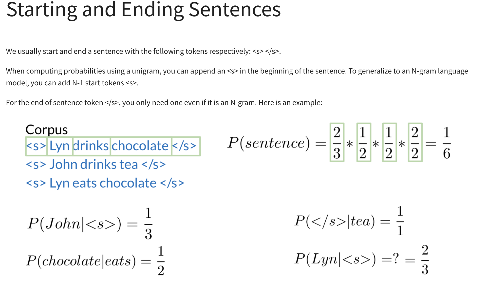

# AutoCorrect
1. identify a misspelled word
2. find strings n edit distance away (these could be random strings)
3. filter candidates  (keep only the real words from the previous steps)
4. calculate word probabilities (choose the word that is most likely to occur in that context)

# N-gram Language Model

## Chain rule in conditional probability
However, this direct approach to sequence probability has its limitations. Since natural language is highly variable, your queries sentence and even longer parts of your sentence are very unlikely to appear in the training corpus

Note that the result is equal to 1 over 6, which is lower than the value of 1 over 3 you might expect when calculating the probability of one of the three sentences in the training corpus. This also applies to the other two sentences in the corpus. This remaining probability can be distributed to other sentences possibly generated from the bigrams in this corpus, and that's how the model generalizes.

## The N-gram Language Model
In the count matrix:

Rows correspond to the unique corpus N-1 grams.

Columns correspond to the unique corpus words.

Here is an example of the count matrix of a bigram.

1. choose sentence start
2. choose the next bigram starting with previous word
3. continue util </s> is picked
